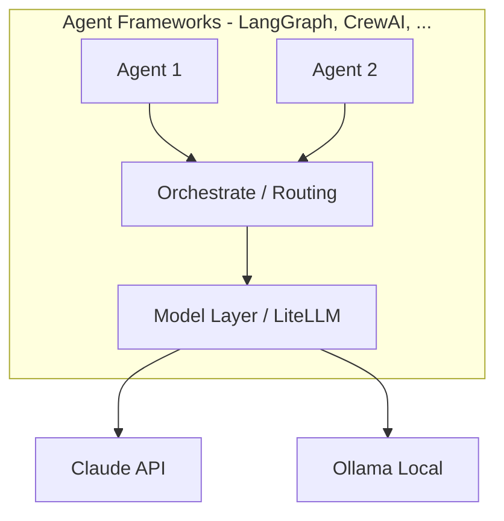
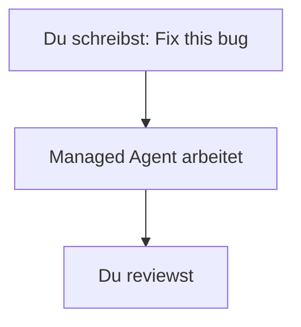
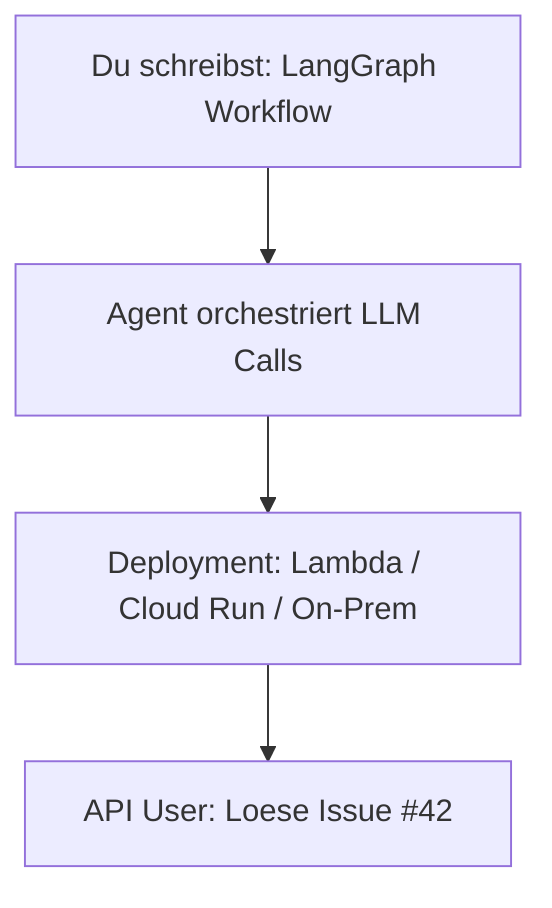
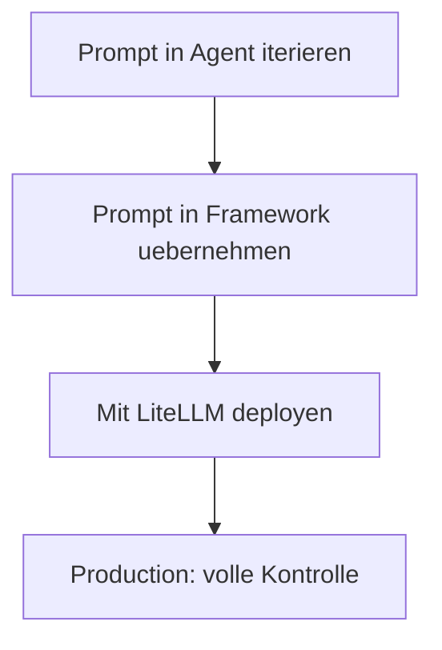
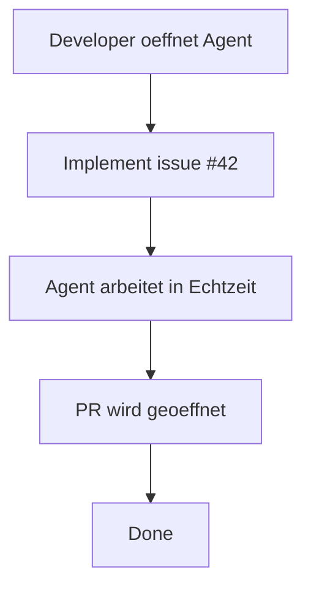
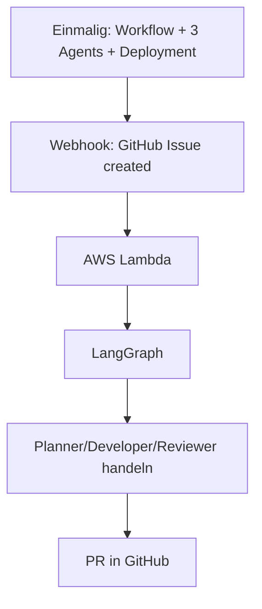
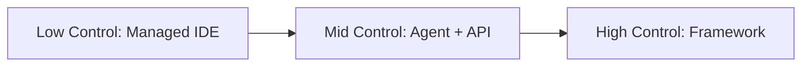
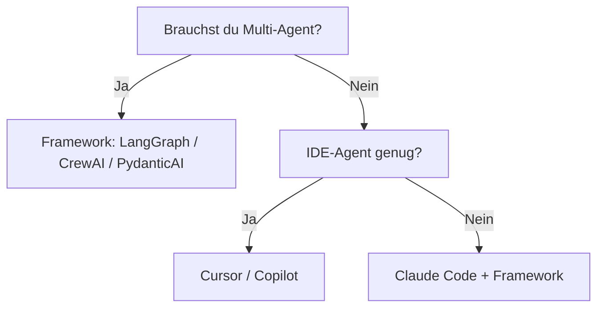

# Agent vs. Framework — Was ist austauschabar?

> ⏱️ 10 Minuten  
> 🎯 Outcome: Verstehen, was du self-hosting vs. outsourcing kannst

---

## Zu Beginn: What are we talking about?"

| Konzept | Definition | Beispiele |
|---------|-----------|----------|
| **Agent** | Ein System, das ein Modell + Tools nutzt, um Ziele eigenständig zu verfolgen | Claude Code, Cursor IDE, Pi Agent, Aider |
| **Framework** | Code-Bibliothek zum Orchestrieren von Agents (Workflows, State, Tool-Calling) | LangGraph, CrewAI, PydanticAI, Mastra |
| **Model** | Das LLM selbst | Claude 3.5, GPT-5, Qwen3 Coder |

---

## Visualisiert

---

## Der Key Decision Tree

Für dein Projekt: **Welcher Teil gehört dir, welcher nicht?**

### Option A: Managed Agent (IDE-basiert)

**Dir gehört:** Dein Code + deine Prompts  
**Dir gehört NICHT:** Der Agent selbst, die Inference

**Beispiele:** GitHub Copilot, Cursor IDE, Windsurf

**Vorteil:**
- ✅ Sofort produktiv
- ✅ Keine Ops/Infrastruktur
- ✅ Beste UX (IDE integriert)

**Nachteil:**
- ❌ Vendor Lock-in (Cursor-Nutzer?)
- ❌ Keine volle Kontrolle über Agent-Verhalten
- ❌ Model-Wechsel = IDE-Wechsel

---

### Option B: DIY Agent + Framework

**Dir gehört:** Alles (Code, Agent, Workflows, Modelle)  
**Du brauchst:** Framework + Model-Provider

**Beispiele:** LangGraph, CrewAI, PydanticAI, Mastra

**Vorteil:**
- ✅ Kontrolle über alles
- ✅ Model-agnostisch (Claude → Qwen via LiteLLM)
- ✅ Skalierbarkeit in Production

**Nachteil:**
- ❌ Mehr Code zu schreiben
- ❌ Du brauchst Infra-Know-How (Deployment, Monitoring)
- ❌ Längerer Feedback-Loop beim Entwickeln

---

### Option C: Hybrid

**Kombination:** Nutze IDE-Agent für schnelle Iteration + Framework für Production

**Das ist der pragmatische Weg für fast alle Teams.**

---

## Comparison Matrix: Agent-IDE vs. Framework

| Aspekt | GitHub Copilot | Cursor | Claude Code | LangGraph | CrewAI | Pi Agent |
|--------|---|---|---|---|---|---|
| **Setup-Zeit** | 5 min (IDE) | 5 min | 5 min | 30 min (Python) | 30 min | 10 min |
| **Model-Wechsel** |  Nicht möglich | Limited | Nur Anthropic | LiteLLM ✅ | Multiple | LiteLLM ✅ |
| **Für Production?** | Naja | Naja | Ja (Web UI) | **Ja** | **Ja** | Ja (CLI) |
| **Kontrolle über Agent-Verhalten** | Gering | Mittel | Hoch | **Maximal** | Maximal | Hoch |
| **Typ** | IDE-Extension | IDE | Web UI + CLI | Python Framework | Python Framework | Python CLI |
| **Self-Host möglich?** | Nein | Nein | Nein...doch (OSS) | **Ja** | **Ja** | Ja |

---

## Ein konkretes Beispiel: "Feature Factory Workflow"

**Szenario:** GitHub-Issue → Automatisch implementiert → PR mit Tests

### Mit Option A (Managed IDE)

### Mit Option B (Framework + DIY)

**Kosten-Nutzen:**
- Option A: 5 Min Pro-Ticket (aber Devs sind blockiert)
- Option B: 4 Std Einrichtung, dann 0 Min pro Ticket (Agents laufen 24/7)

---

## Die wichtigste Entscheidung: Zur "Control Dimension"

Hier ist das Framework, das für dich richtig ist:

---

## Entscheidungsbaum für dein Team

---

## Warum das für dich wichtig ist

🎯 **Jetzt:** Framework wählen ist strategisch, nicht technisch.  
🎯 **Morgen:** Agenten sind über Teams hinweg austauschabar.  
🎯 **In 6 Monaten:** Dein Agent-Ökosystem ist eine echte Infrastruktur.

---

## Konkrete nächste Schritte

1. **Zeithorizon klar:** Nur für mich (IDE)? Oder Produktions-Workflow?
2. **Kontrolle:** Brauche ich Model-Flexibilität? → dann LiteLLM + Framework
3. **Komplexität:** Will ich 1 Agent oder 5? → dann eher Framework
4. **Team-Fähigkeit:** Python? → Framework. Nicht-Devs? → IDE-Agent.

---

**Nächstes Modul:** [Die gesamte Architektur Stack verstehen](architecture-stack.md) (15 min)
