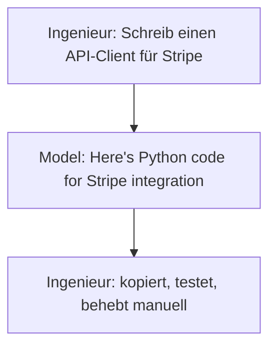
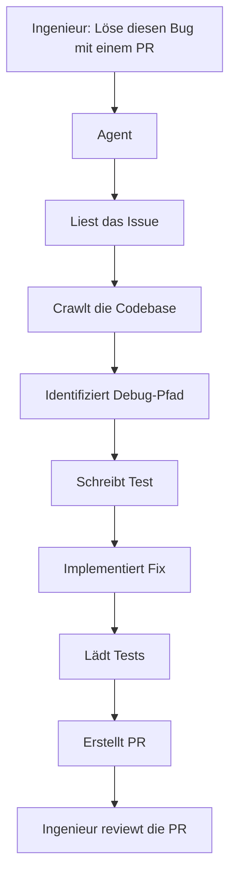
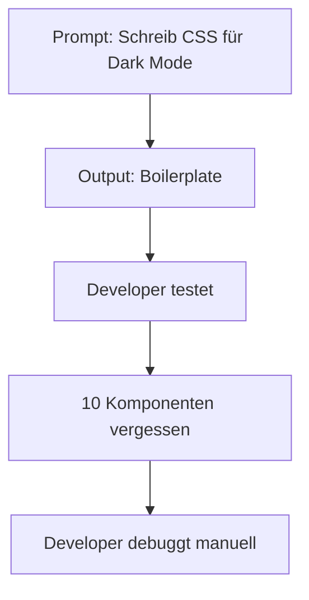
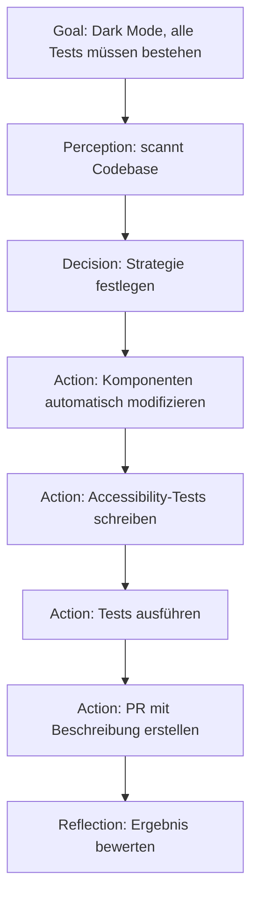
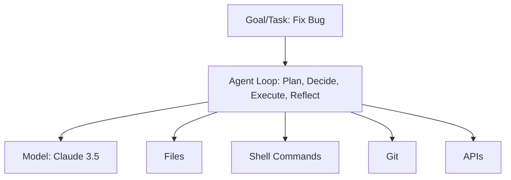

# Model vs. Agent — Der zentrale Unterschied

> ⏱️ 10 Minuten  
> 🎯 Outcome: Verstehen, warum das zwei unterschiedliche Konzepte sind

---

## Die einfache Version

| Aspekt | Model | Agent |
|--------|---------|-------|
| **Was ist es?** | Ein neuronales Netz, trainiert auf Text-Vorhersage | Ein System, das Models nutzt, um Aktionen in der echten Welt auszuführen |
| **Was es tut** | Generiert Text basierend auf Eingabe | Analysiert → Plant → Agiert → Überprüft → Iteriert |
| **I/O** | Text → Model → neuer Text | Ziel → Agent → Aktionen (Dateien, Shell, APIs) |
| **Ohne Internet läuft es?** | Ja (lokal) | Nein (braucht Ziele + Tools) |
| **Training notwendig?** | Ja (pre-training; teuer) | Nein (nutzt ein Model; Prompt-Engineering) |
| **Beispiel** | Claude 3.5 Sonnet, GPT-5, Qwen3 | Claude Code, Cursor IDE, Pi Agent |

---

## Warum das ein Paradigmen-Shift ist

### Vorher (2023): Model-Centric



**Problem:** Das Model ist passiv. Es generiert; der Mensch exekutiert.

### Jetzt (2026): Agent-Centric



**Der Unterschied:** Der Agent war *handlungsfähig*.

---

## Was macht einen Agent "agentic"?

Ein Agent hat mindestens:

### 1. Goal / Mission
```
"Löse diese GitHub Issue"
"Refaktoriere dieses Modul für Performance"
"Schreibe die fehlende Dokumentation"
```

### 2. Perception (Umwelt verstehen)
- Dateien lesen
- Git-History analysieren
- Test-Output parsen
- APIs abfragen

### 3. Decision-Making (Was tun?)
- Hypothesen bilden ("Bug ist in Funktion X")
- Teststrategie wählen
- Implementierungsansatz entscheiden

### 4. Action (Aktionen ausführen)
- Dateien ändern
- Shell-Kommandos
- Git Commands
- Tests starten
- PRs erstellen
- andere Agenten delegieren

### 5. Reflection (Überprüfung)
- "Haben die Tests jetzt bestanden?"
- "Passt das Ergebnis zum Goal?"
- "Was habe ich gelernt, das beim nächsten Mal hilft?"

---

## Ein praktisches Beispiel

### Szenario: "Implementiere Dark Mode für die App"

**Model-Ansatz (2023):**


**Agent-Ansatz (2026):**


Der Agent war **kollaborativ**, **persistent**, **verständig** — nicht nur generativ.

---

## Die technische Architektur



Ein Agent nutzt ein Model, aber das Model ist nur eine Komponente—nicht das Ganze.

---

## Warum das jetzt möglich ist

1. **Tool Use / Function Calling**  
   Models können jetzt sagen: "Ich brauche X und Y zu Analysieren, bitte ruf diese APIs auf."
   
2. **Bessere Reasoning**  
   Claude/GPT-5 können über mehrstufige Probleme nachdenken: Plan → Execute → Debug.
   
3. **MCP (Model Context Protocol)**  
   Standardisierte Schnittstelle: Agent sagt "Lese Dateien", System liefert Dateien — nicht im Prompt rumgehackt.

4. **Höhere Failure Tolerance**  
   Agenten können lernen: "Das funktionzte nicht, versuch anders" (Loops).

---

## Die wichtigsten Unterschiede für deine Karriere

| Skill (2023) | Skill (2026) |
|--------------|------------|
| "Prompt Engineering" | "Agent Design" |
| "Wie formuliere ich die Anfrage?" | "Wie definiere ich Goal, Perception, Actions?" |
| "Ein Prompt schreiben" | "Ein Multi-Agent Workflow bauen" |
| "LLM-APIs" | "Agent Frameworks (LangGraph, CrewAI)" |
| "Was gibt die API zurück?" | "Wie fehlertoleriert ist meine Pipeline?" |

---

## Dein erstes Aha-Moment erlebst du hier

→ [Lab 1: Chat-with-the-Docs RAG App](../07-hands-on-labs/lab-01-chat-with-docs-rag.md)

Dort wirst du sehen:
- Agent analysiert ein echtes Issue
- Agent sagt: "Ich brauch diese Dateien"
- Agent liest sie, denkt, handelt
- Agent lädt Tests
- Agent öffnet PR

**Das ist kein ChatGPT "write me code"-Moment. Das ist echte Autonomie.**

---

## Quick Reference Table: Model vs Agent vs Framework

| Frage | Model | Agent | Framework |
|-------|--------|--------|-----------|
| **Wer führt aus?** | LLM | Agent (nutzt Model) | Orchestrator (nutzt Agents) |
| **Beispiele** | Claude, GPT-5, Qwen | Claude Code, Pi, Aider | LangGraph, CrewAI |
| **Kann selbstständig Fehler fixen?** | Nein (braucht dich) | Ja (Retry-Loops) | Ja (explizite Strategien) |
| **Kostet Geld?** | Per Token | Die Inference + deine Infra | Deine Agents höchstens |
| **Betreibst du selbst?** | Nur lokal (Ollama) | Naja (Prompts selbst) | Ja (orchestrierst Agents) |

---

**Nächster Schritt:** [Agent vs. Framework verstehen](agent-vs-framework.md) (10 min)

