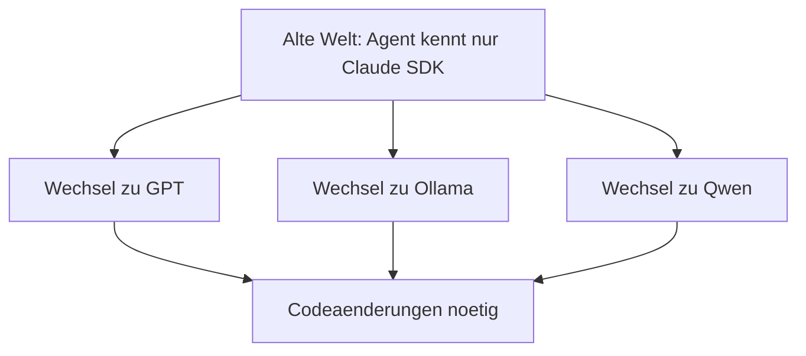
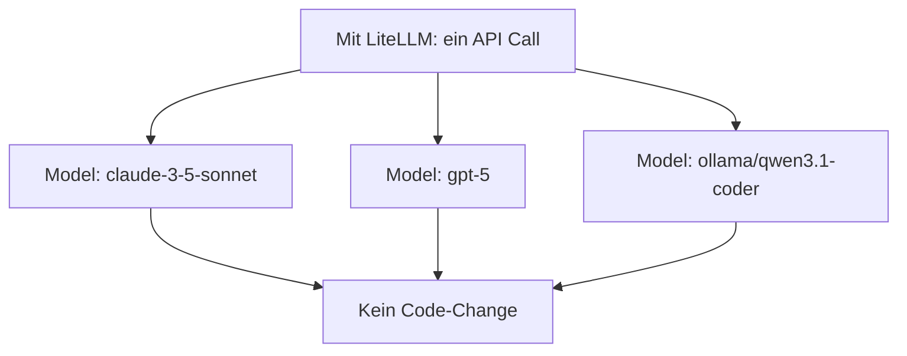

# Inference Layer Deep-Dive: LiteLLM als Plattform

> ⏱️ 30 Min  
> 🎯 Outcome: Verstehen, warum LiteLLM zentral ist + setup für kostenlos

---

## Das Problem, das LiteLLM löst





---

## Warum das für dein Team Gold ist

| Problem | Ohne LiteLLM | Mit LiteLLM |
|---------|-------------|-----------|
| **"Anthropic macht bald keine APIs mehr"** | Projekt broken | `MODEL="gpt-5"` setzen, weiter |
| **"Claude ist zu teuer"** | Umschreiben | `MODEL="ollama/qwen3.1"` setzen, weiter |
| **"Wir brauchen Multi-Model (Routing)"** | Custom Code | LiteLLM built-in Routing |
| **"Fallback wenn Claude-API down?"** | Manual Retry | LiteLLM: automatisch zu GPT-5 |
| **"Cost Control"** | Monitoring pro API | LiteLLM: ein Dashboard |

---

## Die Architektur

```mermaid
flowchart TD
  A[Dein Agent (Python/JS)] --> B[LiteLLM Router / Proxy]
  B --> C[Anthropic API]
  B --> D[OpenAI API]
  B --> E[Ollama local]
  B --> F[Together API]
```

---

## Setup: Dein erstes LiteLLM Projekt (10 Min)

### Option 1: Mit Anthropic API (kostenlos mit free tier)

```bash
# 1. Install
pip install litellm

# 2. API-Key (https://claudeapi.com → free tier 15 RPM)
export ANTHROPIC_API_KEY="sk-ant-..."

# 3. Code
from litellm import completion

response = completion(
    model="claude-3-5-sonnet",
    messages=[
        {"role": "user", "content": "Was ist agentic Programming?"}
    ]
)
print(response.choices[0].message.content)
```

### Option 2: 100% Kostenlos mit Ollama + Qwen3

```bash
# 1. Install Ollama
brew install ollama  # Mac
# oder: https://ollama.ai (Windows/Linux)

# 2. Pull Qwen3 Coder
ollama pull qwen3.1-coder:7b

# 3. Starte Ollama Server
ollama serve  # (in eigenem Terminal)

# 4. Install LiteLLM
pip install litellm

# 5. Code
from litellm import completion

response = completion(
    model="ollama/qwen3.1-coder",
    messages=[
        {"role": "user", "content": "Schreib einen Python Function um Fibonacci zu berechnen"}
    ]
)
print(response.choices[0].message.content)
```

---

## Wichtige Modelle für Agents

| Provider | Modell | Preis | Lokal? | Best For |
|----------|--------|-------|--------|----------|
| **Anthropic** | Claude 3.5 Sonnet | $3/$15 per 1M (in/out) | Nein | **Bestes Tool Use** |
| **OpenAI** | GPT-5 | $15/$60 per 1M | Nein | Reasoning, Multi-Step |
| **Ollama/Local** | Qwen3.1 Coder 7B | $0 (kostenlos) | **Ja** | Offline, keine Kosten |
| **Ollama/Local** | Llama 3.1 70B | $0 (kostenlos) | Ja (heftig) | On-Prem, Enterprise |
| **Together AI** | Qwen/Llama/Mistral | $0.20/$0.60 per 1M | Nein | Open Models + günstig |

---

## LiteLLM Config für Agenten-Teams

Standardmäßig:

```python
import litellm
import os

litellm.api_key = os.getenv("ANTHROPIC_API_KEY")

# Mit Routing: Fallback automatisch
litellm.set_router(router_name="ModelRouter")
```

Oder als Config-File `litellm_config.yaml`:

```yaml
model_list:
  - model_name: "agent-primary"
    litellm_params:
      model: "claude-3-5-sonnet"
      api_key: $ANTHROPIC_API_KEY
  - model_name: "agent-fallback"
    litellm_params:
      model: "ollama/qwen3.1-coder"
      api_base: "http://localhost:11434"
  - model_name: "agent-cheap"
    litellm_params:
      model: "gpt-3.5-turbo"
      api_key: $OPENAI_API_KEY

router_settings:
  # Wenn Claude failed, probier Ollama
  fallback_route: ["agent-fallback"]
```

Dann:

```python
from litellm import Router

router = Router(config_file="litellm_config.yaml")
response = router.completion(
    model="agent-primary",
    messages=[...]
)
```

---

## Warum dein Team LiteLLM lieben wird

### Szenario 1: "Claude-API ist down!"

Mit LiteLLM:
```python
response = router.completion(model="agent-primary", messages=msgs)
# → Automatisches Fallback zu Ollama
# → Workflow weiterhin laufen
```

Ohne LiteLLM:
```python
try:
    from anthropic import Anthropic
    ...
except:
    # Manual fallback code
    from openai import OpenAI
    ...
```

### Szenario 2: "Wir wollen billiger werden"

Mit LiteLLM:
```yaml
# Just change the config
model_name: "agent-primary"
model: "ollama/qwen3.1-coder"  ← Kosten: $0
# Redeploy, fertig.
```

Ohne: Überall im Code ändern.

### Szenario 3: "Wir nutzen 5 verschiedene Modelle"

Mit LiteLLM: Ein API, ein Config File.  
Ohne: 5x unterschiedliche SDKs, 5x API-Management.

---

## Kostenrechnung: Für ein Agent Team

**Szenario:** 100 Agent-Tickets/Monat, 50KB je Ticket durchschnittlich

### Option A: Nur Claude API

```
50 Tickets × 50KB = 2500 KB Input
Kosten: 2500KB / 1M × $3 = $0.0075/Monat
(Plus Output, aber ordnung von cents)
```

→ Praktisch kostenlos mit free tier (15 RPM ≈ ~500/Monat möglich)

### Option B: Ollama lokal

```
$0 (einmalig: 4h Setup, GPU Anforderung)
+ Electricity beim Laufen ~$10/Monat
```

→ Perfekt wenn Geheimhaltung wichtig

### Option C: Hybrid (Smart with LiteLLM)

```
# Cheap Tasks (Einfache Analysen)
model: "ollama/qwen3.1-coder"  → $0

# Complex Tasks (Multi-Step Reasoning)
model: "claude-3-5-sonnet"     → $0.01–0.05 / task

Average: $2–5 / Monat für ein Agent-Team
```

**Das ist praktisch kostenlos.**

---

## Next Steps

1. **Sofort probieren:**
   ```bash
   pip install litellm
   export ANTHROPIC_API_KEY="..." # oder ollama serve
   python -c "from litellm import completion; print(completion(model='claude-3-5-sonnet', messages=[{'role':'user', 'content':'hi'}]))"
   ```

2. **Dein Team:** `litellm_config.yaml` anlegen für eure Standard-Models

3. **In Production:** LiteLLM Proxy aufsetzen für Cost-Tracking + Fallbacks

---

**Nächster Schritt:** [Coding Agent Landscape — Welche Tool passt zu mir?](../03-coding-agents-landscape/selection-matrix.md)
