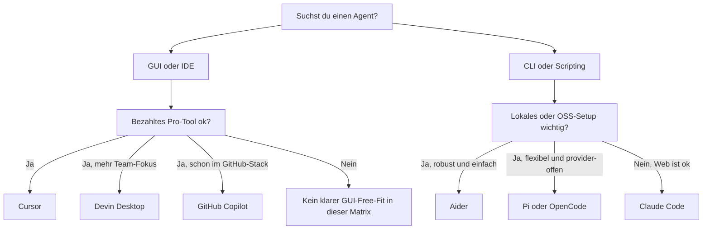
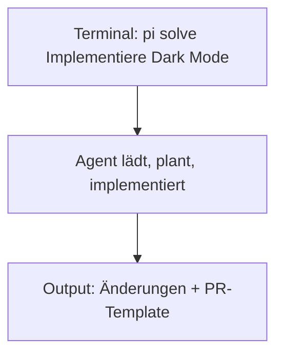
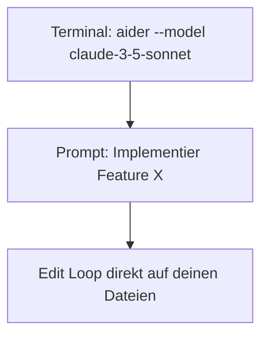
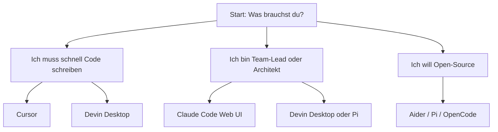

# Agent Selection Matrix — Welcher Agent passt zu mir?

> ⏱️ 15 Minuten  
> 🎯 Ziel: Die richtige Agent-IDE oder CLI für deinen Use Case wählen

## Workshop-Standard

Für den 2-Stunden-Standardpfad nutzen wir **Aider oder OpenCode mit einem lokalen Model** als kostenlose Baseline.

Cursor bleibt eine sehr gute Vergleichsreferenz, ist aber nicht die kostenlose Baseline.

Die gleichen Konzepte lassen sich danach auf Cursor, Claude Code, Devin Desktop (ehemals Windsurf), Copilot und Pi übertragen.

---

## Terminologie-Mapping

| Konzept | Cursor | Claude Code | Devin Desktop (ehemals Windsurf) | GitHub Copilot | Aider | Pi / OpenCode |
|---|---|---|---|---|---|---|
| system prompt | versteckte Basis-Instruktionen | versteckte Basis-Instruktionen | versteckte Basis-Instruktionen | versteckte Plattform-Instruktionen | Prompt-Template | versteckte Plattform-Instruktionen |
| user prompt | Chat oder Kommando | Chat- oder Terminal-Anfrage | Chat-Anfrage | Chat-Anfrage | CLI-Instruktion | CLI- oder Chat-Anfrage |
| rules | Workspace- oder Projektregeln | Repo-Instruktionen oder Skill-Guidance | Workspace-Instruktionen | Repo-Instruktionen oder Admin-Guidance | Prompt-Konventionen | Config oder Prompt-Policy |
| skills | wiederverwendbare skill-ähnliche Workflows | Skills | Workflow-Packs | meist nicht so benannt | Prompt-Templates | Templates oder Plugins |
| sub-agents | delegierte Helfer | Sub-Agents | sekundäre Helfer | eingeschränkt | ungewöhnlich | Orchestrierungshelfer |
| memory | Workspace-Kontext | Memory / Persistenz | Workspace-Kontext | Plattform-Kontext | Git-Historie + Repo-Kontext | Memory- / Kontext-Funktionen |
| tool policy | Workspace-Regeln und Einstellungen | Freigaben und Berechtigungen | Workspace-Policies | Admin- oder Workspace-Policy | Prompt- und Kommando-Konventionen | Config und Freigaben |

---

## Schnell-Entscheidung (Entscheidungsbaum)



---

## Vollständige Vergleichsmatrix

| Eigenschaft | GitHub Copilot | Cursor | Devin Desktop (ehemals Windsurf) | Claude Code | Pi Agent | Aider | OpenCode |
|-----------|---|---|---|---|---|---|---|
| **Kosten** | $10/Monat | $20/Monat | $20/Monat | Kostenlos (Web UI) | Kostenlos | Kostenlos | Kostenlos |
| **Typ** | VSCode Ext | IDE | IDE + Agent Command Center | Web UI + CLI | CLI | CLI | CLI |
| **Erste gelesene Instruktionsdatei (typisch)** | `AGENTS.md` (naechste Datei im Baum) | `.cursor/rules/*.md` bzw. Projektregel | Workspace-/Projekt-Instruktionen (produktabhaengig) | `CLAUDE.md` | Projekt-Config oder Prompt-Datei, kein klarer Standard | `.aider.conf.yml`, keine Standard-Repo-Regeldatei | `AGENTS.md` |
| **Lokal?** | Nein | Nein | Nein | Web nur | Ja (CLI) | Ja | Ja |
| **Model-Wahl** | Nur CoPilot Models | Limited | Limited | Nur Claude | Claude + mehrere | Bring-your-own | Beliebig |
| **MCP Support?** | ✅ | ✅ | ⚠️ Eingeschraenkt / unklar dokumentiert | ✅ | ❓ Oeffentlich unklar | ❌ | ✅ |
| **für Teams (5+ Devs)** | ✅ Gut | ✅ | ✅ | ✅ (Web) | ⚠️ CLI | ⚠️ | ⚠️ |
| **Beste für Refactoring** | ✅ Gut | ✅✅ Exzellent | ✅✅ Exzellent | ✅✅ Exzellent | ✅ Gut | ✅ Gut | ⚠️ |
| **Debugging Support** | ✅ | ✅✅ | ✅✅ | ✅ | ✅ | ✅ | ⚠️ |
| **Aktualisierung** | Regelmäßig | Wöchentlich | Wöchentlich | Häufig | Häufig | Unregelmäßig | Unregelmäßig |
| **Vendor Lock-in** | Hoch (GitHub) | Mittel | Mittel | Mittel (Anthropic) | Tief (Pi) | Niedrig | Niedrig |

---

## Detaillierte Profile

### 🏢 GitHub Copilot

**Typ:** VSCode/GitHub Enterprise Extension


**Am besten geeignet für:**
- ✅ Enterprise Teams (mit GitHub)
- ✅ Leichte Code-Completion + Chat
- ✅ GitHub-Integration (Gespräche werden zu PRs)
- ✅ Admin will zentrale Kontrolle

**Nicht gut für:**
- ❌ Lokale Models
- ❌ Model-Flexibilität
- ❌ Deep Code Refactoring

**Kosten:** $10/Nutzer/Monat (oder Enterprise-Vertrag)

**Setup:** 5 min (VSCode-Erweiterung installieren)

---

### 🎨 Cursor

**Typ:** Eigenständige IDE (Fork von VSCode)

```
Cursor IDE = VSCode + bessere Agent-Integration + eigene Features
```

**Am besten geeignet für:**
- ✅ Einzelne Developer → blitzschnell produktiv
- ✅ Große Refactorings (Multi-File ändern)
- ✅ Bestes Codebase-Verständnis
- ✅ Freelancer / Startups
- ✅ "Agentic-first" Workflow

**Nicht gut für:**
- ❌ Teams mit bestehender VSCode-Config (Migration)
- ❌ Open-Source / lokale Models
- ❌ Wenn ihr schon Copilot bezahlt

**Kosten:** $20/Monat (+ API-Kosten separat)

**Hinweis:** Cursor ist keine kostenlose Baseline. Nutze es nur, wenn Teilnehmende bereits Zugriff haben.

**Setup:** 5 min (Installation + Login)

**Warum beliebt:** Viele Startup-Gründer benutzen Cursor. High-Productivity-Feel.

---

### 🏄 Devin Desktop (ehemals Windsurf)

**Typ:** Eigenständige IDE mit Agent Command Center

```
Devin Desktop = Windsurf-Weiterentwicklung mit Fokus auf Agent-Orchestrierung,
Kanban-gestuetzte Agent-Steuerung und Team-Workflows.
```

**Am besten geeignet für:**
- ✅ Teams (nicht nur Einzelne)
- ✅ Größere Codebasen
- ✅ "Agent-first" Mentalität
- ✅ Collaborative Sessions

**Nicht gut für:**
- ❌ Wenn Cursor schon kauft
- ❌ Nische, weniger Community als Cursor

**Kosten:** $20/Monat

**Setup:** 5 min

**Einschätzung:** Devin Desktop verschiebt den Fokus vom reinen Coding Agent hin zum Orchestrator fuer mehrere lokale und Cloud-Agents.

---

### 🌐 Claude Code (Web)

**Typ:** Im Browser → Web UI + optional CLI


**Am besten geeignet für:**
- ✅ Zero-Setup (Browser öffnen)
- ✅ Zu starke Agenten-Features (MCP, Memory, Skills)
- ✅ Laptop-unabhängig
- ✅ "Denkpause" für komplexe Architektur-Probleme
- ✅ Vollständige Codebase-Exposition möglich

**Nicht gut für:**
- ❌ Keine IDE-Integration (separate Browser-Tab)
- ❌ Bandbreite (grosse Repos hochladen)
- ❌ Offline Nutzung

**Kosten:** Kostenlos (mit Anthropic API Key)

**Setup:** 2 min

**Warum gerade jetzt (2026):** Claude Code ist zur "Denkmaschine" für Agenten geworden. Viele Architekt:innen öffnen Claude Code für strategische Probleme, nicht für tägliches Coding.

---

### 🚀 Pi Coding Agent (CLI)

**Typ:** Terminal und GUI (pi-gui optional)



**Am besten geeignet für:**
- ✅ Scripting / Automation
- ✅ Multi-Provider (Claude + GPT + Qwen + Ollama wechselbar)
- ✅ Lokale Models + Memory-Persistence
- ✅ CI/CD Integration (z.B. "after commit, lauf Pi")
- ✅ Wenn du schon im Terminal lebst
- ✅ Team-Dojo (Agents im Repo, nicht in IDE)

**Nicht gut für:**
- ❌ GUI-liebhaber
- ❌ Echtzeit-Feedback (eher Batch)

**Kosten:** Kostenlos (open source)

**Setup:** 10 min

**Trends 2026:** Pi ist stark wachsend. Viele DevOps-Teams nutzen Pi in CI-Pipelines.

---

### 💚 Aider

**Typ:** CLI (Text-basiert oder Web-UI optional)



**Am besten geeignet für:**
- ✅ Git-Workflow-Liebhaber
- ✅ "Bring your own Model" (Ollama, OpenAI, Anthropic, etc.)
- ✅ Einfachheit (Ein-Command-Setup)
- ✅ Alte Schule / stabiler Code

**Nicht gut für:**
- ❌ Moderne Multi-Agent Features
- ❌ MCP Integration
- ❌ Enterprise-Skalierung

**Kosten:** Kostenlos

**Setup:** 5 min

**Einschätzung:** Der "zuverlässige Veteran". Wenn es funktionieren muss und nicht fancy sein muss, ist Aider stark.

---

### 📦 OpenCode

**Typ:** CLI (Open Source)

```
OpenCode = Aider-meets-modern-agents
```

**Am besten geeignet für:**
- ✅ Open Source Liebhaber
- ✅ Lokale Models (Ollama, vLLM)
- ✅ Maximale Anpassbarkeit
- ✅ Self-Hosting

**Nicht gut für:**
- ❌ Community noch klein
- ❌ Weniger poliert als Aider

**Kosten:** Kostenlos

**Setup:** 15 min

---

## Entscheidungsdiagramm: Welcher Agent passt zu mir?



---

## Praktischer "Entscheidungshelfer"

### Frage 1: Budget?

| Bedingung | Empfehlung |
|---|---|
| Wir zahlen gerne | Cursor / Devin Desktop |
| Kostenlos | Claude Code (Web) / Pi / Aider |
| Kostenlos + Enterprise | OpenCode selbst hosten |

### Frage 2: Model-Flexibilität?

| Bedingung | Empfehlung |
|---|---|
| Nur Claude ist OK | Claude Code |
| Wir wollen wechseln | Pi / Aider / OpenCode (LiteLLM) |

### Frage 3: Integration in bestehende Workflows?

| Bedingung | Empfehlung |
|---|---|
| IDE ist zentral | Cursor / Devin Desktop / Copilot |
| Terminal ist zentral | Pi / Aider / OpenCode |
| Web ist zentral | Claude Code |

### Frage 4: Team-Größe?

| Bedingung | Empfehlung |
|---|---|
| Einzelne Developer | Cursor (bestes UI) |
| Team 5-20 | Devin Desktop / Claude Code + LiteLLM |
| Enterprise 100+ | Claude Code + custom Agent Pipeline + LangGraph |

---

## Meine Top Picks für verschiedene Szenarien

| Use Case | #1 Pick | #2 Alternative | #3 Fallback |
|----------|---------|----------|----------|
| **Schnelle Solo-Productivität** | Cursor | Claude Code | Devin Desktop |
| **Team mit Refactor-Tasks** | Devin Desktop | Cursor | Pi (CLI) |
| **Enterprise mit Costed Control** | Claude Code + LangGraph | Pi | OpenCode |
| **Offline / Geheim** | Aider + Ollama | OpenCode + Qwen | Cursor (lokal mit Qwen) |
| **Automation / CI-CD** | Pi | Aider | claude-code-cli |
| **Learning / Tutorial** | Claude Code (Web) | Cursor | Aider |

---

## Glossary: Was bedeuten diese Begriffe wirklich?

- **IDE-Extension:** Läuft in VSCode/IDE (Cursor ist IDE selbst)
- **CLI:** Terminal-Programm (Pi, Aider, OpenCode)
- **Web UI:** Browser (Claude Code)
- **Agent-Mode:** Agent plant mehrere Aktionen automatisch (nicht nur Chat)
- **MCP:** Model Context Protocol = Standard für Tool-Integration
- **Bring-your-own-Model:** Du wählst selbst das Model (kein Vendor Lock-in)

---

## Häufige Fehler bei der Auswahl

❌ **"Ich nehme die Teuerste"** → Teuer ≠ Richtig für deinen Use Case  
✅ Besser: Teste Cursor (30 min), Claude Code (sofort kostenlos), Pi (kostenlos)

❌ **"Mein Team braucht alle die gleiche IDE"** → Nicht unbedingt notwendig  
✅ Besser: Hybrid. Ein Dev nutzt Cursor, andere Pi. Beide editieren dasselbe Repo.

❌ **"Vendor Lock-in ist nicht wichtig"** → Oh doch. In 1 Jahr wechselst du Provider.  
✅ Besser: Nutze LiteLLM von Anfang an.

---

## Quick-Start: Probiere gleich 3

```bash
# 1. Claude Code Web (sofort)
# → https://claude.ai → Code Mode

# 2. Pi Coding Agent (10 min lokal)
pip install pi-agent
pi-agent solve "Schreib einen Spike für X"

# 3. Cursor (5 min install)
# → https://cursor.com
# Login, öffne Repo, drücke Cmd/Ctrl+K

Danach hast du eine echte Aussage: "Das ist mein Agent."
```

---

**Nächster Schritt:** [Hands-On Lab 1 — Dein erster Agent](../07-hands-on-labs/lab-01-chat-with-docs-rag.md)
