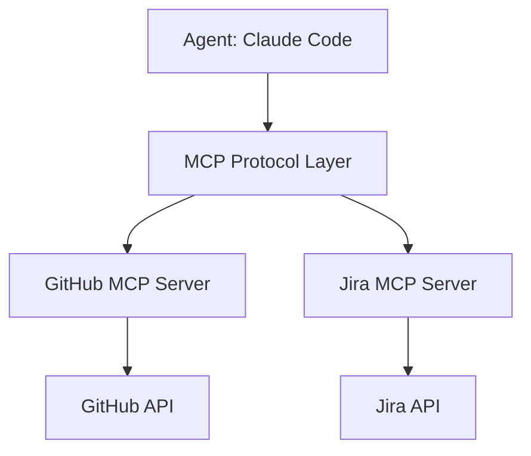
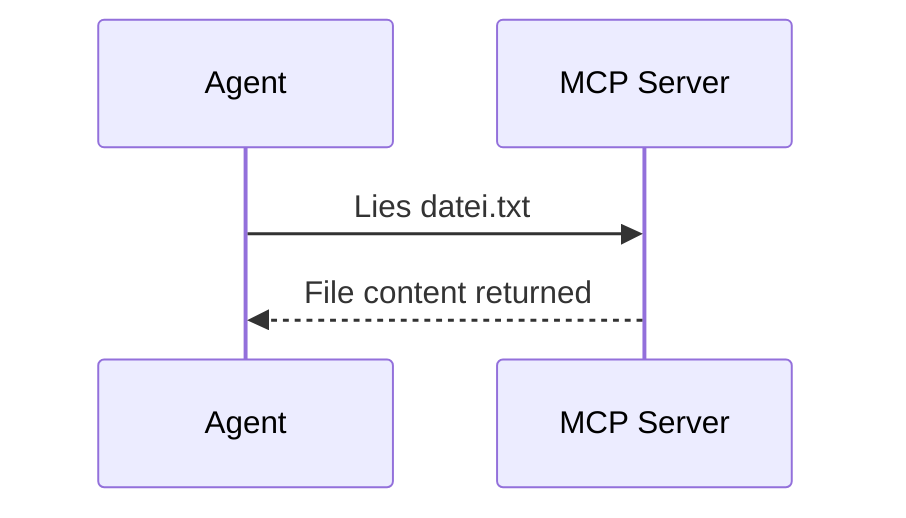
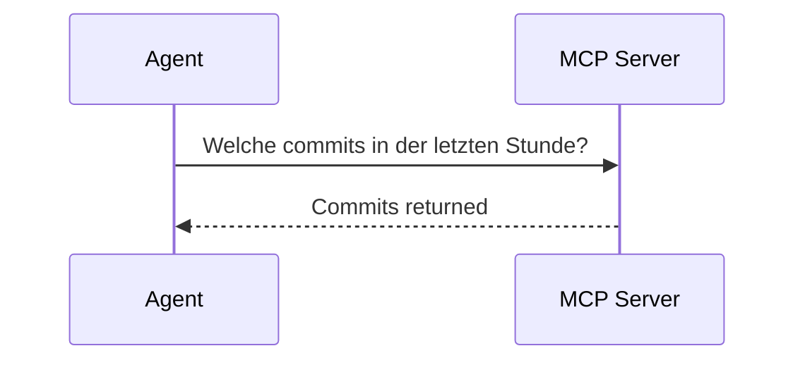
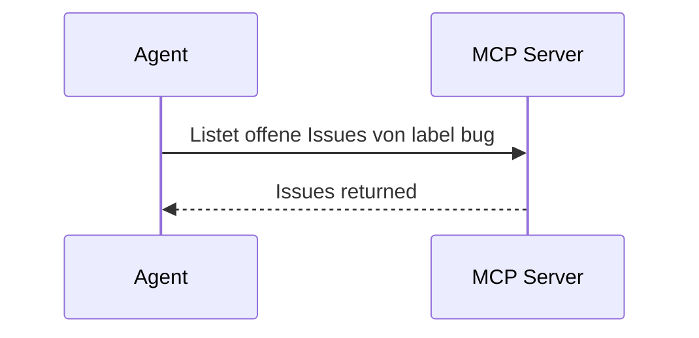
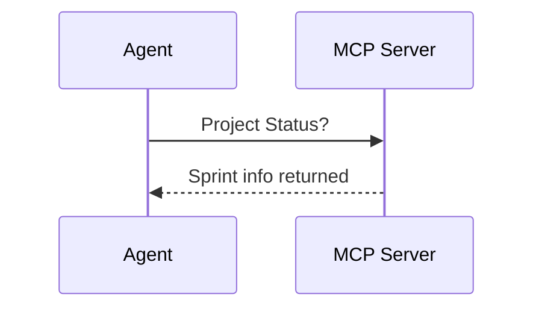
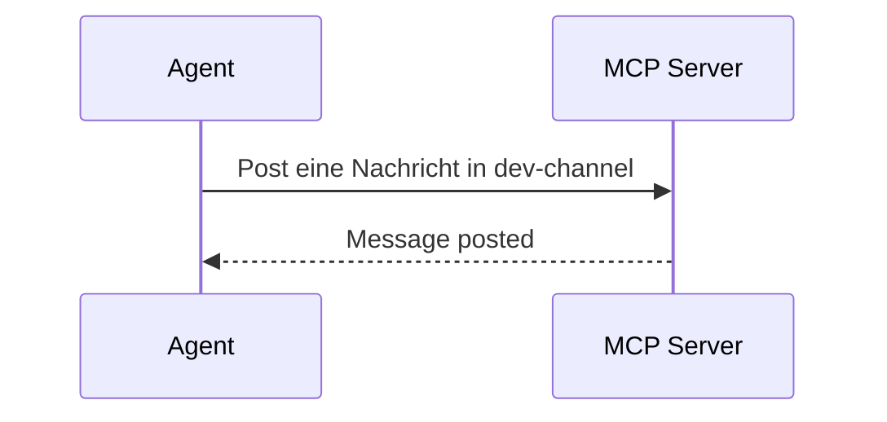
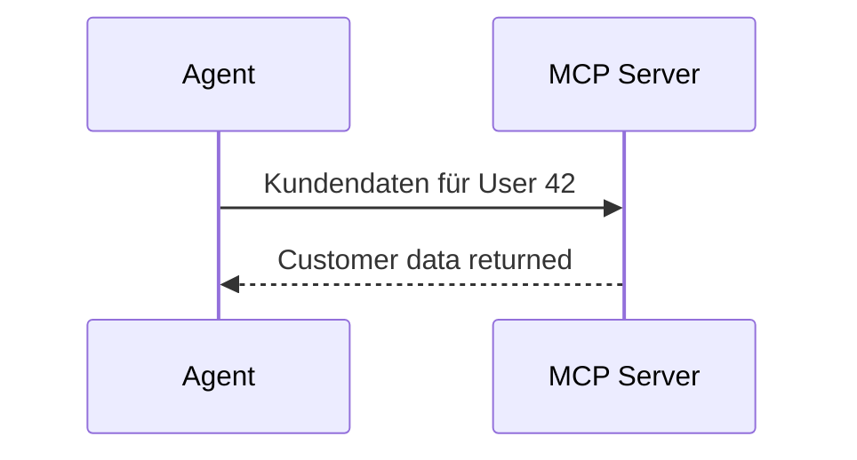
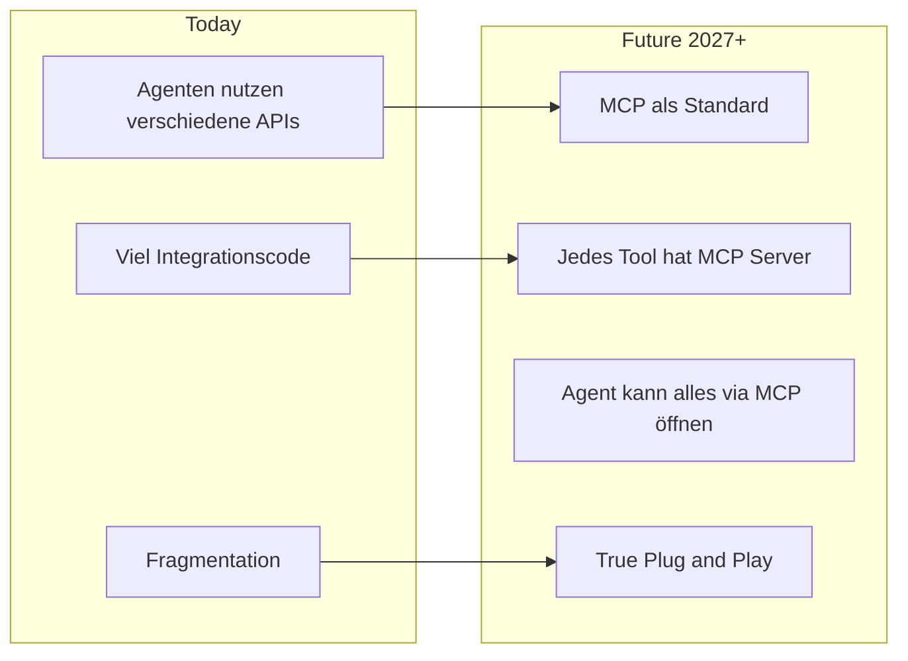
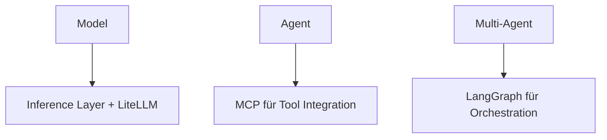

# MCP – Model Context Protocol (Das Herzstück der Agentic Infrastructure)

> ⏱️ 25 Minuten  
> 🎯 Outcome: Warum MCP zentral ist, nicht nur "ChatGPT Plugins 2.0"  
> 🎖️ **PFLICHTLEKTÜRE** für Production-Ready Agenten

---

## Warum MCP jetzt?

Imagine folgendes Szenario:

```
Agent sagt: "Ich muss issue #42 lesen"

Alte Welt (2023):
  Agent: "Ich brauche GitHub Zugriff"
  Developer: "OK, ich pass deinen Prompt an & push GitHub Token..."
  Agent: "Dank. Jetzt brauch ich auch Jira..."
  Developer: "Warte, ich schreib eigenen Code für Jira Integration..."
  Agent: "OK, jetzt braicht ich auch X..."
  Developer: 😭

Neue Welt (2026) mit MCP:
  Agent: "GitHub bitte, via MCP"
  MCP Server:  [Reads Issue via GitHub API]
  Agent: "Jetzt Jira, via MCP"
  MCP Server: [Reads via Jira API]
  Agent: "Filesystem"
  MCP Server: [Local files]
```

Das ist der Unterschied: **MCP ist das Standardisierte "Sprache" zwischen Agents و Tools.**

---

## Die Kernidee

```
Altes Denken:
  Agent ist eine single Entität
  + musse alles direkt können

Neues Denken (MCP):
  Agent ← MCP System ← Tools (File, GitHub, APIs, DBs)
          (Tool Interpreter)
```

MCP = eine Schnittstelle, wo Agents sagen "ich braich dieses Tool". MCP übersetzt.

---

## Die Architektur



---

## Vergleich: MCP vs. Earlier Approaches

| Aspekt | ChatGPT Plugins (2023) | Langchain Custom tools | MCP (2024+) |
|--------|----------------------|----------------------|------------|
| **Standard?** | Nur OpenAI | No (Custom jeweils) | ✅ Yes (Anthropic, others) |
| **Vendor agnostisch?** | Nein | Nein | ✅ Ja |
| **Easy zu erweitern?** | Hard (proprietary) | Mittelmäßig | ✅ Very |
| **Production ready?** | War es | Mittelmäßig | ✅ Increasingly |
| **Sicherheit** | OpenAI managed | DIY | ✅ Better Controls |
| **Transparenz** | Black box | Klar (dein Code) | ✅ Klar (standardisiert) |

---

## MCP Server Typen (Was MCP stellt zur Verfügung)

Die Majoritat der MCP Server sind "Tool Integrations":

### 1. File System Server


### 2. Git Server


### 3. GitHub Server


### 4. Jira Server


### 5. Slack Server


### 6. Custom API Server
Du kannst auch eigene APIs wrappen:


---

## Von oben überwiesenerhalb: Das MCP Protocol

Technisch sieht ein MCP Call so aus:

```json
Agent Request:
{
  "method": "resources/read",
  "params": {
    "uri": "github://issues?label=bug"
  }
}

MCP Server Response:
{
  "contents": [
    {
      "uri": "github://issues/42",
      "mimeType": "application/json",
      "text": "{\"id\": 42, \"title\": \"Fix login bug\", ...}"
    }
  ]
}
```

Der Agent sagt was er braucht. MCP delivert die Daten im Standardformat. Fertig.

---

## Ein praktisches Beispiel: Feature Factory mit MCP

**Scenario:** Automatisiert ein GitHub Issue implementieren

Ohne MCP:
```python
# Developer schreibt:
client.create_agent(
    prompt="""
    You are a coding agent. Here is the GitHub issue:
    [copy/paste entire issue text manually]
    
    When you have a solution, create a pull request. 
    But here's my custom GitHub API wrapper you need to use:
    [300 lines custom code]
    """
)
```

Mit MCP:
```python
# Define once, reuse everywhere
mcp_servers = {
    "github": "mcp://github",  # Built-in
    "jira": "mcp://jira",      # Built-in
    "slack": "mcp://slack"     # Built-in
}

client.create_agent(
    name="feature_factory",
    mcp_servers=mcp_servers,
    prompt="Implement the GitHub issue and create a PR"
    # MCP servers handle all integrations automatically
)
```

Der Agent kann jetzt automatisch:
- Read GitHub Issues
- Check Jira Status
- Post Slack Updates
- Create PRs

**Ohne dass du irgendeinen API-Integration-Code schreiben musst.**

---

## MCP buiintegriert bei Claude Code (vs. andere)

**Claude Code** (Web UI):
```
✅ GitHub MCP eingebaut
✅ Filesystem MCP eingebaut
✅ Jira MCP verfügbar
✅ Slack MCP verfügbar
✅ Custom MCP Servers supportiert
```

Das ist part of warum Claude Code so mächtig ist.

**Pi Coding Agent:**
```
✅ MCP Support (via LiteLLM Config)
```

**LangGraph** (Framework):
```
✅ Full MCP Support (need zur manuellen Konfiguration aber)
```

---

## Setup: Dein erstes MCP (10 Min)

### Option A: Claude Code + GitHub MCP (Sofort)

1. Gehe zu claude.ai -> Code Mode
2. GitHub Repository upload
3. "Let's connect to real GitHub API"
4. Claude Code asks: "GitHub Token?"
5. You provide: GITHUB_TOKEN env var
6. Done. Agent kann jetzt Issues lesen

### Option B: Custom MCP Server schreiben (Advanced, 1h)

Dies ist für ML Engineers / Platform Teams:

```bash
# 1. Install MCP SDK
pip install mcp

# 2. Schreib einen Server
cat > my_mcp_server.py << 'EOF'
from mcp.server import Server
from mcp.types import Resource

server = Server()

@server.resource_handler("internal://metric/{name}")
async def get_metric(name: str):
    # Your logic here
    return fetch_metric_from_db(name)

if __name__ == "__main__":
    server.run()
EOF

# 3. Deploy & connect to Agent
```

---

## Die Zukunft: MCP wird zur Plattform

**Beobachtung 2026:** MCP wird das, was Docker für Container ist — der Standard.



---

## Praktische Implikation für Dich

### Wenn du Berlin Agent-System designest:

✅ **JA:** Use MCP Servers für alle External Integrations  
❌ **NEIN:** Custom API Integration Code

### Wenn man dich fragt "Welches Tool für Agents?":

✅ "Prüfen wir, ob es MCP hat"  
❌ "Lassen Sie Custom Adapter für jedes Tool schreiben"

### In Deinem Next Projekt:

1. Mappe alle Tools, die Agent braucht (GitHub, Jira, Slack, etc.)
2. Check ob MCP Servers existieren
3. Falls nein: Schreib einen (nicht zu schwer)
4. Konfiguriere den Agent
5. Agent kann jetzt alles selbstständig

---

## Häufige Fragen zu MCP

<details>
<summary>F: Ist MCP sicher?</summary>

A: MCP ist ein Protokoll. Sicherheit hängt von deiner Implementation ab.

**Best Practice:**
- Use MCP server auth (API Keys)
- Rate limit MCP servers
- Audit MCP actions
- Network segmentation (MCP server  in VPC)

</details>

<details>
<summary>F: Können Agenten meine Datenbank via MCP?</summary>

A: Ja. Das ist sehr mächtig (und gefährlich).

**Vorsichtsmaßnahmen:**
- Readonly queries nur
- Feldfilter (agent kann nicht HR-sensible Daten lesen)
- Audit logging
- IP Whitelist

</details>

<details>
<summary>F: Brauche ich MCP für einfache Agenten?</summary>

A: Nein. Für einen Single Agent auf einer Aufgabe vielleicht nicht.

Aber: Sobald du scalierst zu mehreren Agenten oder komplexeren Workflows, brauchst du MCP.

</details>

---

## Nächste Schritte

1. **Verstehen:** Du hast jetzt die Konzepte
2. **Hands-On:** [Checkpoint 2: Vertiefung](../07-hands-on-labs/checkpoint-02.md)
3. **Production:** [Multi-Agent Patterns](../06-multi-agent-architectures/swarm-patterns.md)

---

**Merksatz:** MCP ist nicht ein Feature. Es ist die Ebene, auf der moderne Agenten gebaut werden.



MCP is the middle layer. Ohne MCP müssen Agents zu hacky mit Tool-Integration umgehen.

---

[← Zurück zu Module 3](../03-coding-agents-landscape/) | [Weiter zu Checkpoint 2 →](../07-hands-on-labs/checkpoint-02.md)
