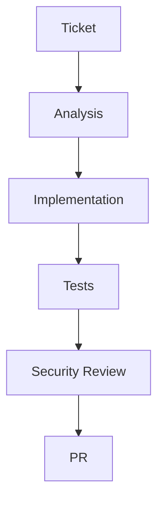

# Feature Factory

Die Feature Factory ist der Kern-Workflow des Workshops: Agenten nehmen ein konkretes Issue, analysieren die Codebasis, implementieren die Änderung, führen Tests aus und erzeugen eine reviewbare Pull Request.

Security Review ist Teil des Workflows und kein nachträglicher Zusatz.

## Warum das wichtig ist

- Es macht den Einsatz von Agenten wiederholbar.
- Es liefert eine Struktur, die Teilnehmende in der Arbeit wiederverwenden können.
- Es schafft einen natürlichen Platz für Security Checks.

## Empfohlene Checkpoints

- Ist der Agent innerhalb der vorgesehenen Dateien geblieben?
- Hat die Implementierung Secrets, unsichere Input-Behandlung oder zu breite Berechtigungen eingeführt?
- Ist der Diff für einen menschlichen Reviewer weiterhin gut nachvollziehbar?
