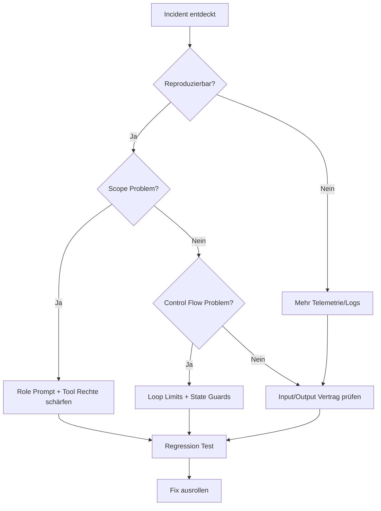

# Failure Modes in Multi-Agent-Systemen

> Ziel: Typische Ausfälle früh erkennen, begrenzen und reproduzierbar beheben.

## Die 7 häufigsten Failure Modes

1. Rollen-Drift
Ein Agent übernimmt Aufgaben ausserhalb seines Scopes.

2. Endlosschleifen
Planner/Reviewer schicken sich Aufgaben ohne Abbruchbedingung zurück.

3. Halluzinierte Abhängigkeiten
Agent referenziert Dateien oder APIs, die nicht existieren.

4. Ungesicherte Tool-Nutzung
Agent liest sensible Daten oder führt riskante Kommandos aus.

5. Inkonsistente Artefakte
Mehrere Worker erzeugen widersprüchliche Outputs.

6. Silent Failure
Ein Schritt scheitert, aber der Gesamtprozess läuft scheinbar weiter.

7. Merge trotz kritischer Findings
Review findet Blocker, Gate greift nicht.

## Diagnose-Flow



## Guardrails pro Failure Mode

| Failure Mode | Signal | Guardrail |
|---|---|---|
| Rollen-Drift | Unpassende Dateiänderungen | Rolle + Dateibereich-Whitelist |
| Endlosschleife | Viele Iterationen ohne Delta | `max_iterations` + Stagnation Detector |
| Halluzination | Datei/API nicht gefunden | Existence Checks vor der Aktion |
| Unsichere Tool-Nutzung | Secret-Dateien im Access Log | Denylist + manuelle Freigabe |
| Inkonsistente Artefakte | Konflikte bei Fan-In | Schema + Aggregator-Validator |
| Silent Failure | Fehlende Teiloutputs | Verbindlicher Status-Heartbeat |
| Merge trotz Blocker | Kritische Findings ignoriert | Harter Policy Gate |

## Incident-Template

```md
## Incident
- Zeitpunkt:
- Betroffener Workflow:
- Auswirkung:

## Root Cause
- Technisch:
- Prozess:

## Fix
- Sofortmassnahme:
- Dauerhafte Maßnahme:

## Prevention
- Neue Guardrail:
- Neuer Test:
```

## Minimum für Production Readiness

- Tracing über alle Agent-Schritte
- Klare Verantwortlichkeit je Knoten im Workflow
- Harte Stop-Kriterien vor Merge/Deploy
- Replay-fähige Runs für Incident Review
- Versionierte Prompts/Rules/Skills

## Nächster Schritt

- Integriere diese Checks in [05-agentic-workflows/security-guardrails.md](../05-agentic-workflows/security-guardrails.md)
- Nutze die Muster aus [Swarm-Patterns](swarm-patterns.md)
