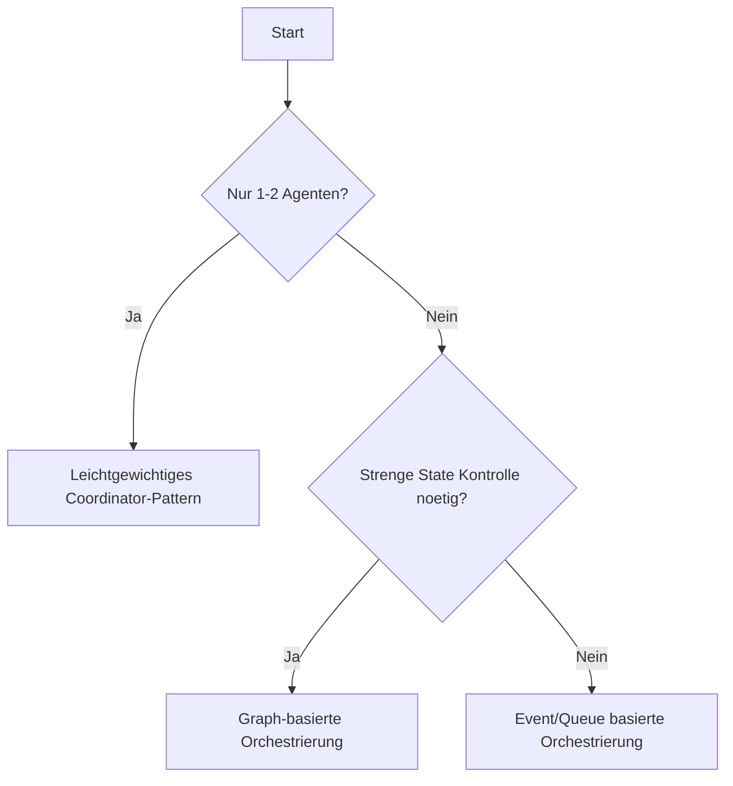
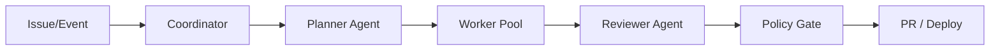

# Orchestrierungs-Frameworks

> Ziel: Das passende Orchestrierungsmodell je nach Teamgroesse, Risiko und Task-Typ waehlen.

## Entscheidungslogik

## Option A: Leichtgewichtiger Coordinator

Beschreibung:
- Ein zentraler Agent delegiert Teilaufgaben.
- Schnell aufzusetzen, gut fuer Workshops und Pilotprojekte.

Staerken:
- Wenig Overhead
- Schnell iterierbar

Schwaechen:
- Skaliert schlecht bei vielen parallelen Streams
- Coordinator kann Bottleneck werden

## Option B: Graph-basierte Orchestrierung

Beschreibung:
- Workflows als Knoten und Kanten mit explizitem Zustand.
- Deterministische Uebergaenge, gute Debuggability.

Staerken:
- Klarer Kontrollfluss
- Reproduzierbare Runs
- Saubere Retry/Fallback-Strategien

Schwaechen:
- Hoeherer Modellierungsaufwand
- Mehr initialer Setup-Aufwand

## Option C: Event/Queue-basiert

Beschreibung:
- Agenten reagieren auf Events aus Queue/Bus.
- Entkoppelt, horizontal skalierbar.

Staerken:
- Hohe Parallelitaet
- Gute Teamentkopplung

Schwaechen:
- Komplexeres Observability-Setup
- Idempotenz zwingend

## Referenzarchitektur

## Governance-Ebene (muss immer da sein)

- Policy Gate vor Merge/Deploy
- Approval bei sensiblen Dateien
- Secret Scanning in jedem Lauf
- Rollback-Strategie fuer fehlerhafte Agent-Aktionen

## Metriken fuer Vergleich

| Metrik | Coordinator | Graph-basiert | Event/Queue |
|---|---|---|---|
| Setup-Zeit | Sehr niedrig | Mittel | Mittel-Hoch |
| Transparenz | Mittel | Hoch | Mittel |
| Skalierung | Niedrig-Mittel | Mittel-Hoch | Hoch |
| Governance | Mittel | Hoch | Hoch |
| Workshop-Fit | Sehr gut | Gut | Mittel |

## Praktische Empfehlung

- Workshop/POC: Coordinator-Pattern
- Team 5-20 mit Qualitaetsanspruch: Graph-basiert
- Plattform/Enterprise: Event + Policy Gates + Observability

## Naechster Schritt

- [Swarm-Patterns](swarm-patterns.md)
- [Failure Modes](failure-modes.md)
