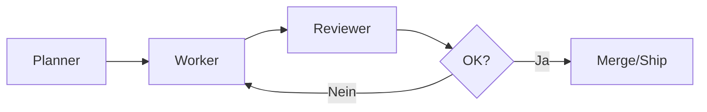
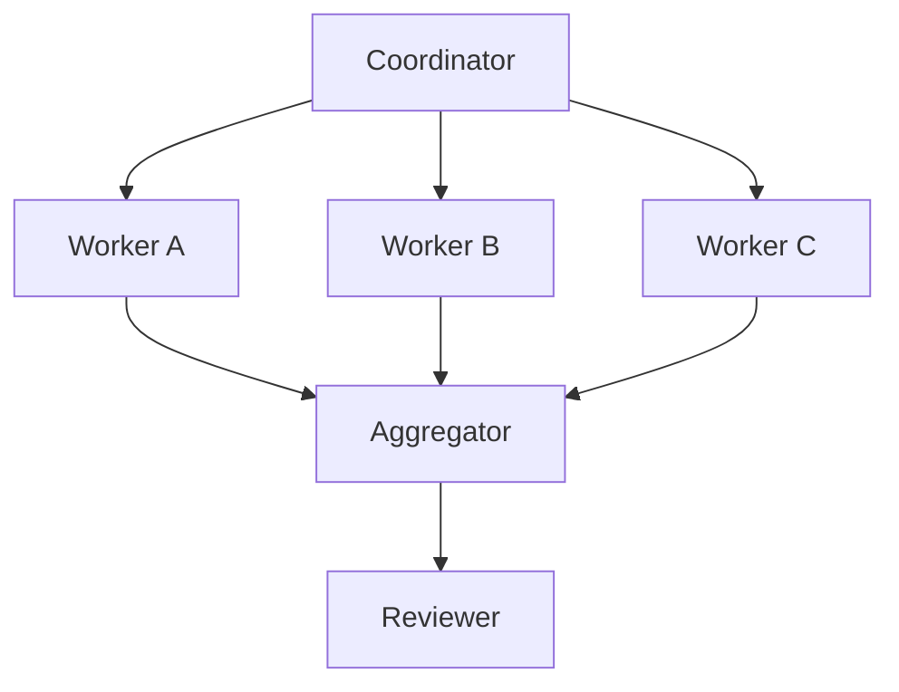
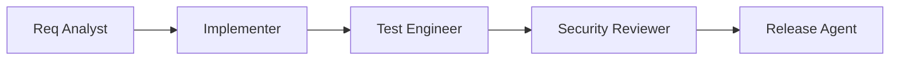
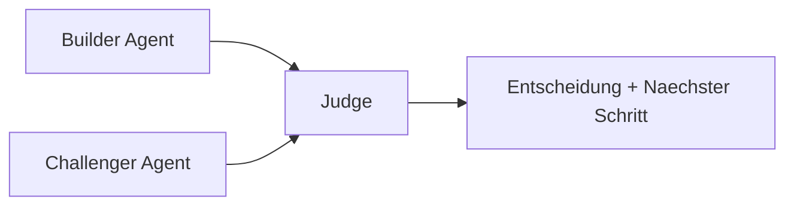

# Swarm-Patterns

> Ziel: Verstehen, wann und wie mehrere Agenten zusammenarbeiten sollten.

## Warum Multi-Agent ueberhaupt?

Ein einzelner Agent ist gut fuer kleine, lineare Tasks.
Sobald Aufgaben parallelisierbar, risikobehaftet oder domanen-uebergreifend sind, lohnt sich eine Aufteilung.

## Kernprinzip

- Zerlege die Arbeit in klare Rollen.
- Definiere Input/Output pro Rolle.
- Fuehre mit expliziten Uebergabepunkten.
- Baue Guardrails und Reviews ein.

## Pattern 1: Planner -> Worker -> Reviewer



Wann nutzen:
- Feature-Entwicklung mit mittlerem Risiko
- Refactorings mit klaren Akzeptanzkriterien

## Pattern 2: Fan-Out / Fan-In



Wann nutzen:
- Parallele Analyse (Security, Performance, DX)
- Große Codebase mit mehreren Modulen

Risiko:
- Inkonsistente Stilentscheidungen zwischen Workern

## Pattern 3: Specialist Chain



Wann nutzen:
- Produktionsnahe Pipelines
- Regulatorische oder sicherheitskritische Bereiche

## Pattern 4: Debate / Red Team



Wann nutzen:
- Architekturelle Entscheidungen
- Prompts/Policy-Design mit hohem Risiko

## Design-Checkliste

- Haben alle Agenten eine klare Rolle?
- Gibt es genau einen Owner fuer finale Entscheidung?
- Sind Schleifen begrenzt (max. Iterationen)?
- Sind Secrets und Schreibrechte minimal?
- Gibt es ein Audit-Log fuer kritische Aktionen?

## Minimales Rollen-Template

```yaml
name: reviewer
purpose: Qualitaet und Risiko vor dem Merge validieren
inputs:
  - patch
  - test_results
outputs:
  - decision
  - findings
limits:
  - kein direkter Push auf main
  - keine Secret-Lesezugriffe
```

## Typische Anti-Patterns

- Zu viele Agenten fuer kleine Aufgaben
- Undefinierte Verantwortung ("alle machen alles")
- Kein gemeinsames Artefakt-Format
- Reviewer ohne echten Stop-Mechanismus

## Naechster Schritt

- [Orchestrierungs-Frameworks](orchestration-frameworks.md)
- [Failure Modes](failure-modes.md)
