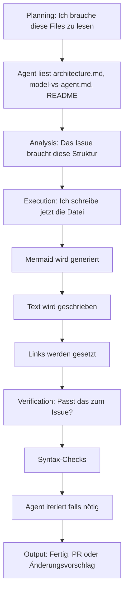

# ✋ Lab 1: Single-Agent-Ticket — Dein erster echter Fall

> **Dauer:** 45 Minuten (20 min Setup + 25 min Lab)  
> **Level:** Anfänger  
> **Ziel:** Ein echtes GitHub-Issue mit Claude Code oder Pi lösen  
> **Ergebnis:** PR mit funktionierendem Code oder Dokumentation

---

## Überblick

Du wirst:

1. ✅ Ein echtes Issue aus dem Repo wählen
2. ✅ Claude Code (oder Pi) starten
3. ✅ Den Agenten dabei beobachten, wie er:
   - Das Issue analysiert
   - Den Code liest  
   - Einen Lösungsplan macht
   - Code schreibt
   - Tests lädt
   - PR erstellt
4. ✅ Du reviewst die PR
5. ✅ Checkpoint: Was funktioniert? Was nicht?

---

## Setup (20 Min)

### Option A: Claude Code Web UI (empfohlen für Anfänger)

**Kostet:** Nichts (mit Anthropic API Free Tier)

```bash
# 1. Anthropic Account + API Key
# https://claudeapi.com
# Sign up → API Keys → Copy "ANTHROPIC_API_KEY"

# 2. Claude Code öffnen
# → https://claude.ai
# → Click "Code Mode" (oben)
```

### Option B: Pi Coding Agent CLI (Wenn du Terminal magst)

```bash
# 1. Pi installieren
pip install pi-agent
# oder: https://github.com/pi-ai/pi-agent

# 2. API Key setzen
export ANTHROPIC_API_KEY="sk-ant-..."  # oder OpenAI, etc.
export PI_MODEL="claude-3-5-sonnet"

# 3. Repo klonen (falls noch nicht geschehen)
git clone <dein-repo> mein-projekt
cd mein-projekt
```

---

## 🎯 Lab Anleitung

### Schritt 1: Ein Issue wählen (5 Min)

Nutze eines dieser Real-Examples oder nimm ein eigenes:

#### Option 1: Aus einem echten Repository

Geh zu einem deiner Repos (z.B. auf GitHub):
- Filtere nach Issues mit Label `good-first-issue` oder `documentation`
- Wähle etwas im 30-Minuten-Umfang (kein Architektur-Desaster)
- **Beispiele:**
  - "Add dark mode toggle"
  - "Document the build process"
  - "Fix typos in README"
  - "Add missing error handling in login"
  - "Create a quick-start guide"

#### Option 2: Aus diesem Repo

Hier ein echtes Issue, das dir hilft zu lernen:

**Issue 1: "Create a 01-agentic-foundations/architecture-stack.md with Mermaid diagrams"**

```
Ziel: Eine neue Datei schreiben mit:
- Architecture Stack erklärt (Text)
- 2-3 Mermaid Diagramme (flowchart, layer diagram)
- Verlinkt zu model-vs-agent.md

Das ist perfekt für Agenten, weil:
- Mermaid ist code-generierbar
- Quellen sind schon geschrieben
- Agent muss verbinden + strukturieren
```

**Issue 2: "Add glossary.md with 20 key terms"**

```
Ziel: Glossary.md schreiben mit:
- Agentic Programming Schlüsselbegriffe
- Kurze Definition
- Link zu relevanton Modul

Perfekt für Agenten, weil:
- Viel Text aus Repos schon existiert
- Agent muss extrahieren + zusammenfassen
```

### Schritt 2: Issue in Claude Code öffnen (5 Min)

#### Mit Claude Code Web:

```
1. https://claude.ai → Code Mode
2. Füge das Repo ein:
   - "I have a GitHub issue I want you to solve"
   - Füge den Issue-Text ein:
   
   "
   Issue: Add architecture-stack.md
   
   Create a file at 01-agentic-foundations/architecture-stack.md
   
   Content should include:
   - Explain the tech stack layers
   - 3-4 Mermaid diagrams showing:
     a) How Models → Inference → Agent → Workflows
     b) How a single Agent works (loop)
     c) How multi-agent orchestration works
   - Link to model-vs-agent.md
   - ~500 words
   
   Requirements:
   - Use Markdown
   - Mermaid syntax must be valid
   - Cross-link to other modules
   - German language preferred
   "

3. Submit
```

#### Mit Pi CLI:

```bash
cd mein-projekt

pi solve "
Das GitHub Issue:
[paste issue text]

Zusätzliche Context:
- Repo location: $(pwd)
- Preferred language: German
- Level: Intermediate
"
```

### Schritt 3: Agent beobachten (15 Min)

Claude Code wird jetzt:



**Wichtig:** Du schaust zu. Das ist nicht passiv. Du kannst **intervenieren**:

<details>
<summary>Claude Code sagt etwas Falsches? — Beispiele & Fixes</summary>

**Szenario 1:** "Agent generiert Mermaid, das nicht valide ist"

```
Du: "Die Syntax ist falsch. Mermaid akzeptiert nur:
     flowchart TD (nicht flowchart D)"

Agent: [behebt es sofort]
```

**Szenario 2:** "Agent vergisst, das Modul zu verlinken"

```
Du: "Vergessen Sie den Link zu model-vs-agent.md 
     am Ende des Files"

Agent: [ergänzt den Link-Abschnitt]
```

**Szenario 3:** "Agent schreibt zu kurz oder zu lang"

```
Du: "Das ist ~150 Worte, brauchen ~500. 
     Erweitern Sie die Erklärung der Agent-Loops."

Agent: [erweitert mit mehr Details]
```

</details>

### Schritt 4: PR reviewen (5 Min)

Sobald der Agent eine PR erstellt hat (oder Vorschläge macht):

```
Checkliste:
☐ Content ist korrekt (inhaltlich)?
☐ Mermaid-Diagramme sind vorhanden & valid?
☐ Links funktionieren?
☐ Deutsch ist korrekt (oder Englisch, je nach Einstellung)?
☐ Format ist konsistent mit anderen Files?
☐ Tests/Syntax-Check ist grün?
```

**Falls nicht alles OK ist:** Den Agenten iterieren lassen. Feedback geben:

```
"Die Diagramme sind großartig, aber
die Erklärung in Schritt 3 ist zu kurz.
Erweitern Sie um ein praktisches Beispiel."
```

### Schritt 5: PR mergen oder Feedback geben

- ✅ **Alles gut?** → Akzeptiere die Changes / merge PR
- ☝️ **Noch Reparaturbedarf?** → Agent weiter iterieren
- 🔄 **Nicht zufrieden?** → Das ist OK. Das ist Learning.

---

## 📊 Checkpoint: Was ist passiert?

Nach dem Lab, beantworte diese Fragen (5-10 Min):

### Inhaltlich

1. **Wie war die Qualität des generierten Code/Text?**
   - [ ] Exzellent (hätte ich selbst nicht besser gemacht)
   - [ ] Gut (minor Fixes notwendig)
   - [ ] OK (funktioniert aber unpoliert)
   - [ ] Schwach (viel Arbeit nötig)

2. **Welche Fehler hat der Agent gemacht?**
   - (Beispiele: Syntaxfehler, falsche Logik, fehlende Edge Cases)

3. **Wie viel Feedback brauchte es bis zum Ziel?**
   - Iterations: 1 / 2 / 3+ / zu viele

### Agentic Performance

4. **Wie war der Planning-Prozess?**
   - War der Plan logisch?
   - Brauchte der Agent Hinweise, oder war er selbstständig?

5. **Fehlertoleranz:**
   - Wenn Tests fehlschlugen, iterierte der Agent selbst?
   - Oder war Dein Input notwendig?

6. **Reflexion:**
   - Hat der Agent seine Fehler erkannt?
   - Hat er sich selbst korrigiert?

### Deine Erkenntnis

7. **Was hätte dieser Agent besser können?**

8. **Wo brauchtest du noch Input?**

9. **Würdest du diesen Agenten für echte Produktions-Tasks nutzen?**
   - [ ] Ja, sofort
   - [ ] Mit Supervision
   - [ ] Eher nicht

---

## 🎓 Lessons Learned

### Wenn der Agent hervorragend war:

**Du hast gerade erlebt:**
- ✅ Autonomie: Agent brauchte wenig Steuerung
- ✅ Verständnis: Agent analysierte Kontext richtig
- ✅ Qualität: Output war nützlich

**Nächster Gedanke:** Wie skaliert das? → [Lab 2: MCP](lab-02-mcp-integration.md)

### Wenn der Agent falsch war:

**Das ist normal!** Agenten sind keine Magie. Typische Gründe sind:

1. **Issue war zu vage** → Bessere Specs brauchen
2. **Agent brauchte mehr Context** → MCP Server (Lab 2)
3. **Model war nicht gut genug** → Stärkeres Model oder bessere Prompts
4. **Problem kommt aus Fehler im Repo** → Edge Case

**Nächster Gedanke:** Strukturiere die Anforderung besser → Lab 2

---

## 🔗 Nächster Schritt

Du hast Lab 1 gemacht. Die Wege:

<details open>
<summary>Route A: Du willst mehr Single-Agent Labs</summary>

Probiere diese Issues:
- "Create a workflow comparison table"
- "Document the Setup Process"
- "Write a FAQ.md"

Dann: [Lab 2: MCP Integration](lab-02-mcp-integration.md)

</details>

<details>
<summary>Route B: Du willst Multi-Agent verstehen</summary>

→ [Module 6: Multi-Agent-Architekturen](../06-multi-agent-architectures/swarm-patterns.md)  
→ [Lab 3: Multi-Agent Pipeline](lab-03-multi-agent-pipeline.md)

</details>

<details>
<summary>Route C: Du willst tiefer in MCP gehen</summary>

→ [Module 4: MCP Fundamentals](../04-mcp-and-tooling/mcp-core-concepts.md)  
→ [Lab 2: MCP Integration](lab-02-mcp-integration.md)

</details>

---

## 💬 Fragen nach dem Lab?

- Diskutiert in [GitHub Discussions](link)
- Oder: [FAQ.md](../faq.md)
- Oder: Schreib ein Issue

**Reflektiere:** Was war neu für dich? Was hat dich überrascht?

---

**Du hast gerade agentic Programming in Aktion gesehen. Glückwunsch!**
