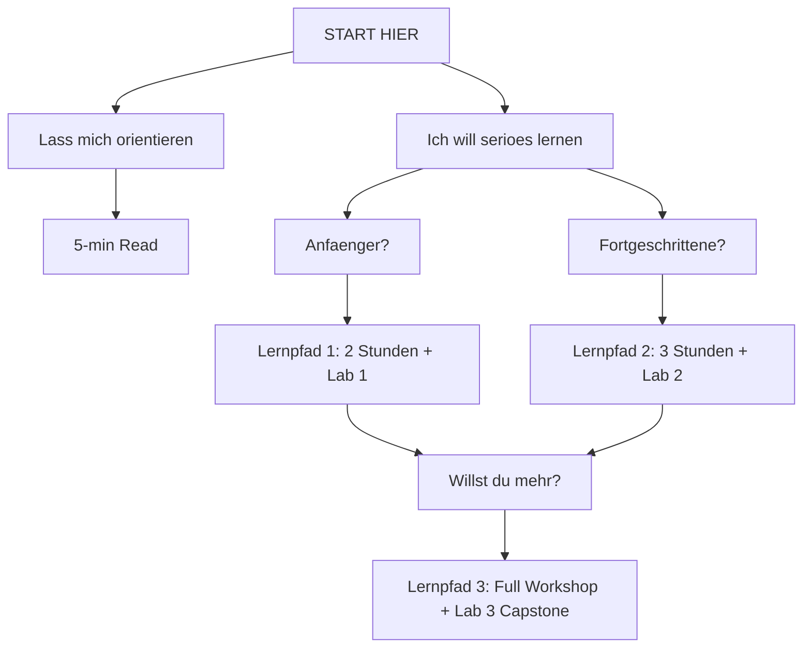

# 🤖 AI Lab III — Agentic Programming

**Level:** Advanced  
**Sprache:** Deutsch  
**Dauer:** Halbtag bis 2 Tage  
**Status:** Live, Juni 2026

Umfassendes, praxisorientiertes Material zu **agentic Programming** für erfahrene Softwareingenieur:innen, Architekt:innen und AI-Enthusiast:innen.

Dieses Repository transformiert Sie von Theorieverstehen zu aktiver, produktiver Agent-Implementierung.

---

## 🎯 30-Sekunden-Essenz

| Punkt | Gestern (Pre-2024) | Heute (2026+) |
|-------|----------|-----------|
| **Fokus** | Mensch schreibt Code | Agent schreibt Code |
| **Ablauf** | Manuelles Coding | Ziel → Agent → PR |
| **Tool** | LLM-Chat | Coding Agent (IDE oder CLI) |
| **Infra** | API Keys | LiteLLM + MCP |
| **Skalierung** | 1 Agent | Multi-Agent-Swarms |

**Die Revolution:** 🔑 **Agenten führen Aktionen aus**, nicht nur Text zu generieren.

---

## 🗺️ Schnelle Navigation

<details open>
<summary><strong>⏱️ Ich habe 5 Minuten</strong></summary>

→ Lies die nächsten zwei Absätze. Das ist dein "Aha-Moment".

</details>

<details>
<summary><strong>⏱️ Ich habe 30 Minuten</strong></summary>

→ [Lernpfade: 30-Min Route](00-start-here/learning-paths.md#ultra-schnell)

</details>

<details>
<summary><strong>⏱️ Ich habe 2 Stunden (Anfänger)</strong></summary>

→ [Lernpfad 1: Anfänger](00-start-here/learning-paths.md#pfad-1-anfänger)

Die beste Einstiegsroute: Konzepte + Live-Lab.

</details>

<details>
<summary><strong>⏱️ Ich habe 3 Stunden (mit Vorwissen)</strong></summary>

→ [Lernpfad 2: Intermediate](00-start-here/learning-paths.md#pfad-2-intermediate)

Für die, die bereits Modelle verstehen.

</details>

<details>
<summary><strong>⏱️ Ich habe einen ganzen Tag (Architekt-Level)</strong></summary>

→ [Lernpfad 3: Full Workshop](00-start-here/learning-paths.md#pfad-3-advanced--full-workshop)

Mit Capstone und Multi-Agent Orchestration.

</details>

---

## 📚 Repository-Struktur: Die 8 Module

```mermaid
flowchart TD
   R[Repository]

   R --> M00[00-start-here]
   R --> M01[01-agentic-foundations]
   R --> M02[02-models-and-inference]
   R --> M03[03-coding-agents-landscape]
   R --> M04[04-mcp-and-tooling]
   R --> M05[05-agentic-workflows]
   R --> M06[06-multi-agent-architectures]
   R --> M07[07-hands-on-labs]
   R --> M08[08-workshop-facilitator]
   R --> AS[assets]
   R --> GL[glossary.md]
   R --> FQ[faq.md]

   M00 --> M00A[learning-paths.md]
   M00 --> M00B[prerequisites.md]
   M00 --> M00C[two-hour-workshop-path.md]

   M01 --> M01A[model-vs-agent.md]
   M01 --> M01B[agent-vs-framework.md]

   M02 --> M02A[abstraction-layers-litellm.md]

   M03 --> M03A[selection-matrix.md]
   M03 --> M03B[terminal-agents.md]

   M04 --> M04A[mcp-core-concepts.md]

   M05 --> M05A[feature-factory.md]
   M05 --> M05B[security-guardrails.md]
   M05 --> M05C[secure-software.md]
   M05 --> M05D[zugangsdaten-und-agenten.md]
   M05 --> M05E[agent-terminology.md]
   M05 --> M05F[workflows-terminology-matrix.md]

   M06 --> M06A[swarm-patterns.md]
   M06 --> M06B[orchestration-frameworks.md]
   M06 --> M06C[failure-modes.md]

   M07 --> M07A[lab-01-single-agent-ticket.md]
   M07 --> M07B[checkpoint-01.md]
   M07 --> M07C[checkpoint-02.md]

   M08 --> M08A[half-day-agenda.md]

   AS --> ASD[diagrams]
   AS --> AST[templates]
   AST --> ASTA[security-review-skill.md]
   AST --> ASTB[ui-specification.md]

   click M00 "00-start-here/" "00-start-here"
   click M01 "01-agentic-foundations/" "01-agentic-foundations"
   click M02 "02-models-and-inference/" "02-models-and-inference"
   click M03 "03-coding-agents-landscape/" "03-coding-agents-landscape"
   click M04 "04-mcp-and-tooling/" "04-mcp-and-tooling"
   click M05 "05-agentic-workflows/" "05-agentic-workflows"
   click M06 "06-multi-agent-architectures/" "06-multi-agent-architectures"
   click M07 "07-hands-on-labs/" "07-hands-on-labs"
   click M08 "08-workshop-facilitator/" "08-workshop-facilitator"
   click AS "assets/" "assets"
   click AST "assets/templates/" "assets/templates"

   click M00A "00-start-here/learning-paths.md" "learning-paths.md"
   click M00B "00-start-here/prerequisites.md" "prerequisites.md"
   click M00C "00-start-here/two-hour-workshop-path.md" "two-hour-workshop-path.md"

   click M01A "01-agentic-foundations/model-vs-agent.md" "model-vs-agent.md"
   click M01B "01-agentic-foundations/agent-vs-framework.md" "agent-vs-framework.md"

   click M02A "02-models-and-inference/abstraction-layers-litellm.md" "abstraction-layers-litellm.md"

   click M03A "03-coding-agents-landscape/selection-matrix.md" "selection-matrix.md"
   click M03B "03-coding-agents-landscape/terminal-agents.md" "terminal-agents.md"

   click M04A "04-mcp-and-tooling/mcp-core-concepts.md" "mcp-core-concepts.md"

   click M05A "05-agentic-workflows/feature-factory.md" "feature-factory.md"
   click M05B "05-agentic-workflows/security-guardrails.md" "security-guardrails.md"
   click M05C "05-agentic-workflows/secure-software.md" "secure-software.md"
   click M05D "05-agentic-workflows/zugangsdaten-und-agenten.md" "zugangsdaten-und-agenten.md"
   click M05E "05-agentic-workflows/agent-terminology.md" "agent-terminology.md"
   click M05F "05-agentic-workflows/workflows-terminology-matrix.md" "workflows-terminology-matrix.md"

   click M06A "06-multi-agent-architectures/swarm-patterns.md" "swarm-patterns.md"
   click M06B "06-multi-agent-architectures/orchestration-frameworks.md" "orchestration-frameworks.md"
   click M06C "06-multi-agent-architectures/failure-modes.md" "failure-modes.md"

   click M07A "07-hands-on-labs/lab-01-single-agent-ticket.md" "lab-01-single-agent-ticket.md"
   click M07B "07-hands-on-labs/checkpoint-01.md" "checkpoint-01.md"
   click M07C "07-hands-on-labs/checkpoint-02.md" "checkpoint-02.md"

   click M08A "08-workshop-facilitator/half-day-agenda.md" "half-day-agenda.md"

   click ASTA "assets/templates/security-review-skill.md" "security-review-skill.md"
   click ASTB "assets/templates/ui-specification.md" "ui-specification.md"

   click GL "glossary.md" "glossary.md"
   click FQ "faq.md" "faq.md"
```



---

## 🎓 Was du lernst (konkrete Ergebnisse)

Nach diesem Material kannst du:

### ✅ Konzeptuell Verstehen
- [ ] Den Unterschied zwischen Model, Agent, Framework, und Workflow
- [ ] Warum MCP zentral ist (nicht ChatGPT Plugins 2.0)
- [ ] Inference Provider vs. Runtime unterscheiden
- [ ] Multi-Agent Architectures designen

### ✅ Agentische Produktivitaet verstehen
- [ ] System Prompts, Rules, Skills und Sub-Agents unterscheiden
- [ ] Die Terminologie verschiedener Coding Agents in eine gemeinsame Tabelle uebertragen
- [ ] Regeln und Skills als zentrale Produktivitäts- und Sicherheits-Schicht einsetzen

### ✅ Praktisch anwenden
- [ ] Ein echtes GitHub-Issue mit Claude Code loesen
- [ ] Einen MCP Server schreiben
- [ ] Eine 3+ Agent Pipeline orchestrieren
- [ ] Ein echtes Codebase-Refactoring mit Agenten

### ✅ Strategisch entscheiden
- [ ] Die richtige Agent-IDE fuer dein Team waehlen (Cursor vs. Copilot vs. Claude Code vs. Pi)
- [ ] Kostenmodelle fair voneinander unterscheiden
- [ ] Fehlerszenarien in agentic Systems kennen
- [ ] Sicherheits-Grenzen für Agenten-Tooling festlegen
- [ ] Sichere Modelle fuer Zugangsdaten in agentischen Workflows definieren
- [ ] Secure-Coding-Prinzipien in agentische Workflows integrieren
- [ ] Produktions-ready Deployments planen

### ✅ Workshop-Standardpfad anwenden
- [ ] Einen Free-First-2-Stunden-Workshoppfad durchfuehren
- [ ] Eine wiederverwendbare Skill- oder Rule-Datei anlegen
- [ ] Dieselbe Instruktion in anderen Coding Agents übersetzen

---

## 🛠️ Empfohlener Tech Stack (Kostenlos oder Minimal)

> **Philosophie:** Kostenlos starten, später upgraden wenn nötig.

### Tier 1: Kostenlos + Powerful

| Layer | Empfehlung | Kosten | Warum |
|-------|-----------|--------|------|
| **Model** | Claude 3.5 Sonnet (via API) | $0 (free tier) oder $15-60/1M tokens | Beste Tool Use & Agent Reasoning |
| **Inference** | LiteLLM (Abstraction) | $0 (Tool) | Provider-agnostisch |
| **Lokal Alternative** | Qwen3.1 Coder via Ollama | $0 (100% offline) | Garantiert kostenlos, keine Abhängigkeiten |
| **Coding Agent** | Claude Code (Web UI) | $0 | Integriertes MCP, bestes Verstaendnis |
| **Alternatives Agent-Tool** | Pi Coding Agent (CLI) | $0 (Open Source) | Multi-Provider, persistentes Memory |

### Setup in 10 Minuten

```bash
# Option A: Cloud + LiteLLM (Anthropic Free Tier)
export ANTHROPIC_API_KEY="sk-ant-..."  # https://claudeapi.com
pip install litellm
# Dann: Claude Code Web UI nutzen (https://claude.ai)

# Option B: 100% Lokal mit Ollama
brew install ollama
ollama pull qwen3.1-coder:7b
ollama serve  # (eigenes Terminal)

# Test
python -c "from litellm import completion; print(completion(model='ollama/qwen3.1-coder', messages=[{'role':'user', 'content':'hi'}]))"
```

---

## 🚀 Dein Einstieg — Drei Optionen

### Option 1: Schnelle Orientierung (5 min)

- Lies obiges "30-Sekunden-Essenz" (✓ gerade gemacht!)
- [Model vs. Agent verstehen](01-agentic-foundations/model-vs-agent.md) (10 min)
- Entscheidung treffen: "Will ich tiefer gehen?"

**Resultat:** Du weißt, warum Agenten anders sind.

---

### Option 2: Anfänger-Track (2 Stunden + Hands-On)

1. [Lernpfad 1 Anfänger](00-start-here/learning-paths.md#pfad-1-anfänger) (30 min Theorie)
2. [Lab 1: Single Agent Ticket](07-hands-on-labs/lab-01-single-agent-ticket.md) (45 min Praxis)
3. [Checkpoint 1](07-hands-on-labs/checkpoint-01.md) (10 min Validierung)
4. Optional: [Lab 1 nochmal mit anderem Issue](07-hands-on-labs/lab-01-single-agent-ticket.md) (45 min Vertiefung)

**Resultat:** Du hast einen Agent in Action gesehen. Deine erste PR.

---

### Option 3: Architektonisches Verstaendnis (3 Stunden)

1. [Foundations Deep Dive](01-agentic-foundations/) (30 min)
2. [Inference Layer + LiteLLM](02-models-and-inference/abstraction-layers-litellm.md) (30 min)
3. [MCP Fundamentals](04-mcp-and-tooling/mcp-core-concepts.md) (25 min)
4. [Lab 2: MCP Integration](07-hands-on-labs/lab-02-mcp-integration.md) (1 h)
5. [Multi-Agent Intro](06-multi-agent-architectures/swarm-patterns.md) (20 min)

**Resultat:** Du kannst Agenten-Systeme in der Tiefe designen.

---

## 💼 Workshop-Modi (Wie du das Repo nutzt)

### 🎓 Selbststudium (asynchron)
- Repo klonen
- Einen [Lernpfad](00-start-here/learning-paths.md) wählen
- Labs lokal durcharbeiten
- Optional: Issues im Repo posten für Austausch

### 👨‍🏫 Instructor-Led (synchron)
- Halbtag (4h): [Agenda hier](08-workshop-facilitator/half-day-agenda.md)
- Ganztag (8h): [Agenda hier](08-workshop-facilitator/full-day-agenda.md)
- Trainer nutzt `08-workshop-facilitator/` Material + Moderations-Tipps
- Teilnehmende in Breakout-Gruppen

### 🤝 Team Dojo (wiederholendes Lernen)
- Wöchentlich 1h: Ein Modul + ein Mini-Lab
- Vorbereitung asynchron → gemeinsame Diskussion
- Anwendung auf echtes Ticket der Woche

---

## 🔍 Häufige Einstiegsfragen

<details>
<summary><strong>F: Ich kenne Agents überhaupt nicht. Wo anfangen?</strong></summary>

→ [Lernpfad 1: Anfänger](00-start-here/learning-paths.md#pfad-1-anfänger)

30 Min Konzepte + 45 Min Lab = echte Kompetenz.

</details>

<details>
<summary><strong>F: Ich habe kein Budget — geht das trotzdem?</strong></summary>

→ **Ja!** Setup-Option B (Ollama + Qwen3.1 Coder): Voellig kostenlos, laeuft lokal.

Oder Anthropic Free Tier (15 Requests pro Minute), das reicht für Labs.

</details>

<details>
<summary><strong>F: Ist das Material nur für Startup oder auch Enterprise?</strong></summary>

→ **Beide!** 

Fuer **Startups:** Option B (Ollama) + Cursor IDE = $0-20  
Fuer **Enterprise:** Claude Code + LangGraph + Custom MCP = produktionsreif auf Enterprise-Niveau

</details>

<details>
<summary><strong>F: Kann ich das mit meinem Team durcharbeiten?</strong></summary>

→ **Ja!** Schau dir den [Team-Dojo-Modus](00-start-here/workshop-modes.md) an.

Oder host einen [1-Tag Workshop](08-workshop-facilitator/full-day-agenda.md) mit diesem Material.

</details>

<details>
<summary><strong>F: Diese Begriffe sind konfus (Agent vs Framework vs MCP?)</strong></summary>

→ [Glossary.md](glossary.md) hilft. Oder:
- [Model vs. Agent](01-agentic-foundations/model-vs-agent.md)
- [Agent vs. Framework](01-agentic-foundations/agent-vs-framework.md)

</details>

---

## 📚 Zusätzliche Ressourcen

- [📖 Glossar & Akronyme](glossary.md) — Begriff nachschlagen
- [❓ FAQ](faq.md) — "Das funktioniert nicht"
- [🔗 Weiterfuehrende Ressourcen](REFERENCES.md) — Originalquellen
- [💬 Diskussionen im Repo](faq.md) — Fragen und Antworten an einem Ort

---

## 🎯 Learning Path Entscheidungsbaum



**Naechster Schritt:** Waehle oben einen Pfad. Klicke auf den Link. Los geht's!

---

## 📝 Lizenz

Dieses Material wird unter einer offenen Lizenz bereitgestellt (Details folgen).  
Beiträge sind willkommen: Issues, PRs, Diskussionen.

---

## 🗣️ Feedback & Austausch

- **Bug Report:** GitHub Issues
- **Frage/Diskussion:** GitHub Discussions
- **Beitrag:** PRs mit Improvements
- **Workshop-Anfrage:** (wird noch bekanntgegeben)

---

**Material aktualisiert:** Juni 2026  
**Level:** Advanced / Praktiker  
**Sprache:** Deutsch (Englisch spaeter moeglich)  
**Status:** 🟢 Live — aktuelle Version

**Willkommen im agentic Programming.** Viel Spass beim Lernen!
