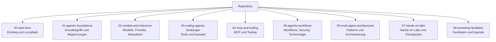
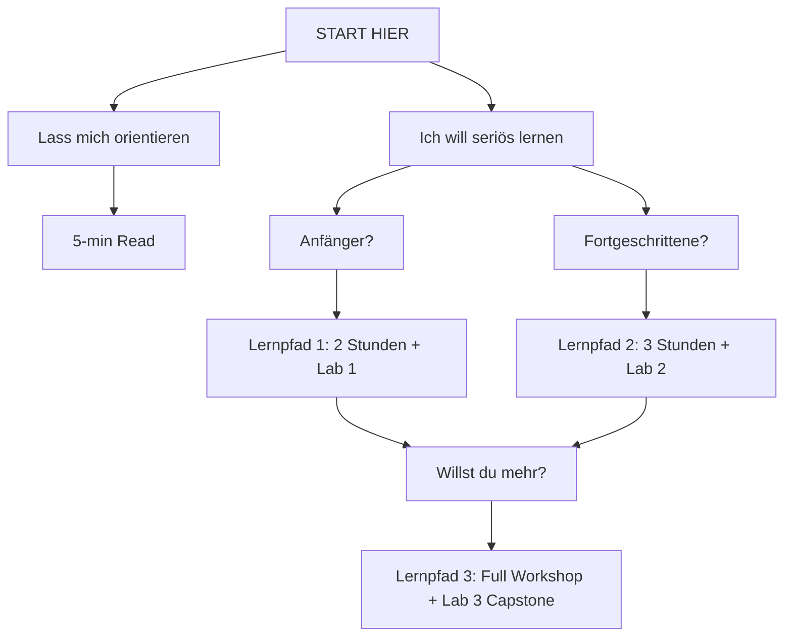

# 🤖 AI Lab III — Agentic Programming

**Level:** Advanced  
**Sprache:** Deutsch  
**Dauer:** Halbtag bis 2 Tage  
**Status:** Live, Juni 2026

Umfassendes, praxisorientiertes Material zu **agentic Programming** für erfahrene Softwareingenieur:innen, Architekt:innen und AI-Enthusiast:innen.

Dieses Repository transformiert Sie von Theorieverstehen zu aktiver, produktiver Agent-Implementierung.

---

## 🎯 30-Sekunden-Essenz

| Punkt | Gestern (Pre-2024) | Heute (2026+) |
|-------|----------|-----------|
| **Fokus** | Mensch schreibt Code | Agent schreibt Code |
| **Ablauf** | Manuelles Coding | Ziel → Agent → PR |
| **Tool** | LLM-Chat | Coding Agent (IDE oder CLI) |
| **Infra** | API Keys | LiteLLM + MCP |
| **Skalierung** | 1 Agent | Multi-Agent-Systeme |

**Die Revolution:** 🔑 **Agenten führen Aktionen aus**, statt nur Text zu generieren.

---

## 🗺️ Schnelle Navigation

<details open>
<summary><strong>⏱️ Ich habe 5 Minuten</strong></summary>

→ Lies die nächsten zwei Absätze. Das ist dein "Aha-Moment".

</details>

<details>
<summary><strong>⏱️ Ich habe 30 Minuten</strong></summary>

→ [Lernpfade: 30-Min Route](00-start-here/learning-paths.md#ultra-schnell)

</details>

<details>
<summary><strong>⏱️ Ich habe 2.5 Stunden (Einsteiger)</strong></summary>

→ [Lernpfad 1: Workshop-Standard](00-start-here/learning-paths.md#pfad-1-workshop-standard-25-stunden)

Die beste Einstiegsroute: Konzepte + Live-Lab.

</details>

<details>
<summary><strong>⏱️ Ich habe 3 Stunden (mit Vorwissen)</strong></summary>

→ [Lernpfad 2: Intermediate](00-start-here/learning-paths.md#pfad-2-intermediate)

Für die, die bereits Models verstehen.

</details>

<details>
<summary><strong>⏱️ Ich habe einen ganzen Tag (Architekt-Level)</strong></summary>

→ [Lernpfad 3: Full Workshop](00-start-here/learning-paths.md#pfad-3-advanced--full-workshop)

Mit Capstone und Multi-Agent Orchestration.

</details>

---

## 📚 Repository-Struktur: Die 8 Module



Die Grafik zeigt bewusst nur die acht Kernmodule. Die eigentliche Navigation ist unten als sprechende Linkübersicht aufgebaut, damit du direkt in die Inhalte springen kannst, ohne technische Dateinamen lesen zu müssen.

### Schnellnavigation

| Modul | Direktzugang |
|-------|--------------|
| 00 | [Start hier](#modul-00) |
| 01 | [Agentic Foundations](#modul-01) |
| 02 | [Models und Inference](#modul-02) |
| 03 | [Coding Agents Landscape](#modul-03) |
| 04 | [MCP und Tooling](#modul-04) |
| 05 | [Agentic Workflows](#modul-05) |
| 06 | [Multi-Agent Architectures](#modul-06) |
| 07 | [Hands-on Labs](#modul-07) |
| 08 | [Workshop Facilitator](#modul-08) |
| Extra | [Querschnitt und Hilfsmaterial](#querschnitt) |

<a id="modul-00"></a>
<details>
<summary><strong>00 Start hier</strong> - Einstieg, Voraussetzungen, Lernpfade</summary>

- [Lernpfade und empfohlene Reihenfolgen](00-start-here/learning-paths.md)
- [Voraussetzungen für Workshop und Labs](00-start-here/prerequisites.md)
- [Workshop Rules und Skills (Governance-Vertiefung)](00-start-here/workshop-rules-and-skills.md)
- [Legacy-Hinweis: Zwei-Stunden-Workshoppfad](00-start-here/two-hour-workshop-path.md)

</details>

<a id="modul-01"></a>
<details>
<summary><strong>01 Agentic Foundations</strong> - Grundbegriffe und Abgrenzungen</summary>

- [Was ein Model ist und was ein Agent leistet](01-agentic-foundations/model-vs-agent.md)
- [Wann ein Agent sinnvoll ist und wann ein Framework](01-agentic-foundations/agent-vs-framework.md)

</details>

<a id="modul-02"></a>
<details>
<summary><strong>02 Models und Inference</strong> - Modelle, Provider, Abstraktion</summary>

- [Abstraktionsschichten mit LiteLLM verstehen](02-models-and-inference/abstraction-layers-litellm.md)

</details>

<a id="modul-03"></a>
<details>
<summary><strong>03 Coding Agents Landscape</strong> - Tools und Auswahl</summary>

- [Entscheidungsmatrix für Agenten-Tools](03-coding-agents-landscape/selection-matrix.md)
- [Terminal-basierte Coding Agents im Überblick](03-coding-agents-landscape/terminal-agents.md)

</details>

<a id="modul-04"></a>
<details>
<summary><strong>04 MCP und Tooling</strong> - MCP-Grundlagen und Tooling</summary>

- [MCP-Kernkonzepte verständlich erklärt](04-mcp-and-tooling/mcp-core-concepts.md)

</details>

<a id="modul-05"></a>
<details>
<summary><strong>05 Agentic Workflows</strong> - Workflows, Security, Terminologie</summary>

- [Feature Factory: vom Ziel zur Umsetzung](05-agentic-workflows/feature-factory.md)
- [Security Guardrails für Agenten-Workflows](05-agentic-workflows/security-guardrails.md)
- [Secure Software in agentischen Umgebungen](05-agentic-workflows/secure-software.md)
- [Zugangsdaten und Agenten sicher handhaben](05-agentic-workflows/zugangsdaten-und-agenten.md)
- [Wichtige Begriffe rund um agentische Workflows](05-agentic-workflows/agent-terminology.md)
- [Begriffe und Workflows in einer gemeinsamen Matrix](05-agentic-workflows/workflows-terminology-matrix.md)
- [Workflow-README des Moduls](05-agentic-workflows/README.md)

</details>

<a id="modul-06"></a>
<details>
<summary><strong>06 Multi-Agent Architectures</strong> - Patterns und Orchestrierung</summary>

- [Swarm-Patterns für mehrere Agenten](06-multi-agent-architectures/swarm-patterns.md)
- [Orchestrierungs-Frameworks einordnen](06-multi-agent-architectures/orchestration-frameworks.md)
- [Typische Failure Modes und Gegenmaßnahmen](06-multi-agent-architectures/failure-modes.md)

</details>

<a id="modul-07"></a>
<details>
<summary><strong>07 Hands-on Labs</strong> - Praktische Übungen und Checkpoints</summary>

- [Lab: Self-contained Chat-with-the-Docs RAG App bauen](07-hands-on-labs/lab-01-chat-with-docs-rag.md)
- [Teilnehmer-Worksheet fuer Lab 1 (Kern + Bonus)](07-hands-on-labs/worksheet-lab-01-llm-chat.md)
- [Checkpoint 1 für den praktischen Fortschritt](07-hands-on-labs/checkpoint-01.md)
- [Checkpoint 2 für den praktischen Fortschritt](07-hands-on-labs/checkpoint-02.md)
- [API-Keys und Registrierung (konsolidiert in Modul 00)](00-start-here/prerequisites.md)

</details>

<a id="modul-08"></a>
<details>
<summary><strong>08 Workshop Facilitator</strong> - Durchführung und Moderation</summary>

- [Halbtages-Agenda für die Durchführung](08-workshop-facilitator/half-day-agenda.md)
- [Facilitation-Skript fuer den 2.5h-Standard](08-workshop-facilitator/facilitation-script-2.5h.md)

</details>

<a id="querschnitt"></a>
<details>
<summary><strong>Querschnitt und Hilfsmaterial</strong> - Glossar, FAQs und Templates</summary>

- [Glossar der zentralen Begriffe](glossary.md)
- [Häufige Fragen im Überblick](faq.md)
- [FAQ für Entscheider:innen](faq-executive.md)
- [FAQ zu Engineering und Security](faq-engineering-security.md)
- [Template für einen Security-Review-Skill](assets/templates/security-review-skill.md)
- [Template für eine UI-Spezifikation](assets/templates/ui-specification.md)
- [Zentrale Terminologie-Matrix](./_shared/_terminology-matrix.md)
- [Zentrale Provider-Optionen (konsolidiert in Modul 00)](00-start-here/prerequisites.md)

</details>

---

## 🎓 Was du lernst (konkrete Ergebnisse)

Nach diesem Material kannst du:

### ✅ Konzeptuell Verstehen
- [ ] Den Unterschied zwischen Model, Agent, Framework und Workflow
- [ ] Warum MCP zentral ist (nicht ChatGPT Plugins 2.0)
- [ ] Inference Provider vs. Runtime unterscheiden
- [ ] Multi-Agent Architectures designen

### ✅ Agentische Produktivität verstehen
- [ ] System-Prompts, Rules, Skills und Sub-Agents unterscheiden
- [ ] Die Terminologie verschiedener Coding Agents in eine gemeinsame Tabelle übertragen
- [ ] Regeln und Skills als zentrale Produktivitäts- und Sicherheits-Schicht einsetzen

### ✅ Praktisch anwenden
- [ ] Ein echtes GitHub-Issue mit Claude Code lösen
- [ ] Einen MCP Server schreiben
- [ ] Eine 3+ Agent Pipeline orchestrieren
- [ ] Ein echtes Codebase-Refactoring mit Agenten

### ✅ Strategisch entscheiden
- [ ] Die richtige Agent-IDE für dein Team wählen (Cursor vs. Copilot vs. Claude Code vs. Pi)
- [ ] Kostenmodelle fair voneinander unterscheiden
- [ ] Fehlerszenarien in agentic Systems kennen
- [ ] Sicherheits-Grenzen für Agenten-Tooling festlegen
- [ ] Sichere Models für Zugangsdaten in agentic Workflows definieren
- [ ] Secure-Coding-Prinzipien in agentische Workflows integrieren
- [ ] Produktions-ready Deployments planen

### ✅ Workshop-Standardpfad anwenden
- [ ] Einen Free-First-2-Stunden-Workshoppfad durchführen
- [ ] Eine wiederverwendbare Skill- oder Rule-Datei anlegen
- [ ] Dieselbe Instruktion in anderen Coding Agents übersetzen

---

## 🛠️ Empfohlener Tech Stack (Kostenlos oder Minimal)

> **Philosophie:** Free-first, plattformunabhaengig und workshoptauglich in 2 Stunden.
> Für eine detaillierte Zuordnung von vorhandenen Abonnements (z. B. Google, Cursor, GitHub, Claude) zu den jeweiligen IDEs und Agents siehe [Voraussetzungen und Setup](00-start-here/prerequisites.md).

### Tier 1: Kostenlos + Schnell startklar (Empfohlene Kombi)

| Layer | Standard | Kosten | Warum |
|-------|----------|--------|------|
| **IDE + Agent** | VS Code + [Cline Extension](https://marketplace.visualstudio.com/items?itemName=saoudrizwan.claude-dev) | $0 (Open Source) | BYOK-faehig, MCP-nativ, Modell-agnostisch |
| **Inference Provider** | [OpenRouter](https://openrouter.ai/) | $0 (Free Models) | Ein Key fuer viele Modelle, Budget-Steuerung |
| **Standard-Model** | `nvidia/nemotron-3-ultra-550b-a55b:free` | $0 (kostenlos) | Leistungsstarkes Coding-Modell, kein Guthaben noetig |
| **Lokal Alternative** | Ollama + Qwen3 | $0 (100% lokal) | Offline-faehig, keine Cloud-Abhaengigkeit |

### Frei verfuegbare Alternativen (ebenfalls vorbereitet)

| Kategorie | Tools |
|-----------|------|
| **VS Code Agents** | Cline, Continue, GitHub Copilot |
| **CLI Agents** | Aider, Claude Code (CLI), Pi Agent, OpenCode |
| **Inference** | OpenRouter, Google AI Studio, GitHub Models, Ollama lokal |

### Setup in 10 Minuten (VS Code + Cline + OpenRouter)

```bash
# 1) Dev Container oeffnen (installiert alle Tools automatisch)
# VS Code: Reopen in Container

# 2) Umgebungsdatei erstellen
cp .env.example .env

# 3) Cline in VS Code installieren und konfigurieren:
#    - Extension Marketplace: "Cline" suchen, installieren
#    - API-Provider: OpenRouter
#    - Modell: nvidia/nemotron-3-ultra-550b-a55b:free
#    - API-Key aus .env (OPENROUTER_API_KEY) eintragen

# 4) .env mit eigenem OpenRouter-Key befuellen
#    - Registrierung: https://openrouter.ai/keys
#    - Key erstellen und in .env eintragen
```

---

## 🚀 Dein Einstieg — Drei Optionen

### Option 1: Schnelle Orientierung (5 min)

- Lies obiges "30-Sekunden-Essenz" (✓ gerade gemacht!)
- [Model vs. Agent verstehen](01-agentic-foundations/model-vs-agent.md) (10 min)
- Entscheidung treffen: "Will ich tiefer gehen?"

**Resultat:** Du weißt, warum Agenten anders sind.

---

### Option 2: Einsteiger-Track (2.5 Stunden)

1. [Lernpfad 1 Workshop-Standard](00-start-here/learning-paths.md#pfad-1-workshop-standard-25-stunden) (50 min Theorie + Setup)
2. [Lab 1: LLM Chat App mit Bonus-RAG](07-hands-on-labs/lab-01-chat-with-docs-rag.md) (95 min Praxis)
3. [Checkpoint 1](07-hands-on-labs/checkpoint-01.md) (5 min Validierung)
4. Optional: Bonus-RAG im selben Lab (20-30 min)

**Resultat:** Du hast einen Agent in Action gesehen. Deine erste PR.

---

### Option 3: Architektonisches Verständnis (3 Stunden)

1. [Foundations Deep Dive](01-agentic-foundations/) (30 min)
2. [Inference Layer + LiteLLM](02-models-and-inference/abstraction-layers-litellm.md) (30 min)
3. [MCP Fundamentals](04-mcp-and-tooling/mcp-core-concepts.md) (25 min)
4. [Checkpoint 2: Vertiefung und Transfer](07-hands-on-labs/checkpoint-02.md) (1 h)
5. [Multi-Agent Intro](06-multi-agent-architectures/swarm-patterns.md) (20 min)

**Resultat:** Du kannst Agenten-Systeme in der Tiefe designen.

---

## 💼 Workshop-Modi (Wie du das Repo nutzt)

### 🎓 Selbststudium (asynchron)
- Repo klonen
- Einen [Lernpfad](00-start-here/learning-paths.md) wählen
- Labs lokal durcharbeiten
- Optional: Issues im Repo posten für Austausch

### 👨‍🏫 Instructor-Led (synchron)
- Standard (2.5h): [Agenda hier](08-workshop-facilitator/half-day-agenda.md)
- Praxisleitfaden: [Facilitation-Skript](08-workshop-facilitator/facilitation-script-2.5h.md)
- Trainer nutzt die Materialien in [08-workshop-facilitator](08-workshop-facilitator/half-day-agenda.md) plus Moderations-Tipps
- Teilnehmende in Breakout-Gruppen

### 🤝 Team Dojo (wiederholendes Lernen)
- Wöchentlich 1h: Ein Modul + ein Mini-Lab
- Vorbereitung asynchron → gemeinsame Diskussion
- Anwendung auf echtes Ticket der Woche

---

## 🔍 Häufige Einstiegsfragen

<details>
<summary><strong>F: Ich kenne Agents überhaupt nicht. Wo anfangen?</strong></summary>

→ [Lernpfad 1: Workshop-Standard](00-start-here/learning-paths.md#pfad-1-workshop-standard-25-stunden)

Kompakte Theorie + konkretes Hands-on ergeben schnell belastbare Kompetenz.

</details>

<details>
<summary><strong>F: Ich habe kein Budget — geht das trotzdem?</strong></summary>

→ **Ja!** Die empfohlene Kombi VS Code + Cline + OpenRouter + `nvidia/nemotron-3-ultra-550b-a55b:free` ist vollständig kostenlos.

Alternativen: Ollama + Qwen3 (100% lokal) oder Google AI Studio (Free Tier).

</details>

<details>
<summary><strong>F: Ist das Material nur für Startup oder auch Enterprise?</strong></summary>

→ **Beide!** 

für **Startups:** Option B (Ollama) + Cursor IDE = $0-20  
für **Enterprise:** Claude Code + LangGraph + Custom MCP = produktionsreif auf Enterprise-Niveau

</details>

<details>
<summary><strong>F: Kann ich das mit meinem Team durcharbeiten?</strong></summary>

→ **Ja!** Starte mit [Lernpfad 1](00-start-here/learning-paths.md#pfad-1-workshop-standard-25-stunden) und skaliere dann in [Pfad 3](00-start-here/learning-paths.md#pfad-3-advanced--full-workshop).

Oder hoste einen Workshop mit [Agenda](08-workshop-facilitator/half-day-agenda.md) plus [Facilitation-Skript](08-workshop-facilitator/facilitation-script-2.5h.md).

</details>

<details>
<summary><strong>F: Diese Begriffe sind konfus (Agent vs. Framework vs. MCP)?</strong></summary>

→ [Glossary](glossary.md) hilft. Oder:
- [Model vs. Agent](01-agentic-foundations/model-vs-agent.md)
- [Agent vs. Framework](01-agentic-foundations/agent-vs-framework.md)

</details>

---

## 📚 Zusätzliche Ressourcen

- [📖 Glossary & Akronyme](glossary.md) — Begriff nachschlagen
- [❓ FAQ Hub](faq.md) — Einstieg und Navigation
- [🧭 FAQ Executive](faq-executive.md) — Nutzen, Risiko, ROI, Einführung
- [🛡️ FAQ Engineering & Security](faq-engineering-security.md) — Qualität, Guardrails, Architektur, Betrieb
- [🔗 Weiterführende Ressourcen](REFERENCES.md) — Originalquellen
- [💬 Diskussionen im Repo](faq.md) — Fragen und Antworten an einem Ort

---

## 🎯 Learning Path Entscheidungsbaum



**Nächster Schritt:** Wähle oben einen Pfad. Klicke auf den Link. Los geht's!

---

## 📝 Lizenz

Dieses Material wird unter einer offenen Lizenz bereitgestellt (Details folgen).  
Beiträge sind willkommen: Issues, PRs, Diskussionen.

---

## 🗣️ Feedback & Austausch

- **Bug Report:** GitHub Issues
- **Frage/Diskussion:** GitHub Discussions
- **Beitrag:** PRs mit Improvements
- **Workshop-Anfrage:** (wird noch bekanntgegeben)

---

**Material aktualisiert:** Juni 2026  
**Level:** Advanced / Praktiker  
**Sprache:** Deutsch (Englisch später möglich)  
**Status:** 🟢 Live — aktuelle Version

**Willkommen im agentic Programming.** Viel Spaß beim Lernen!
